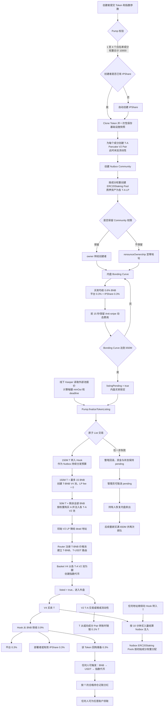

# Pump / Token V13、Basket V4 与 NutboxRouter 发布记录

本文记录 2026-09-08 版本的实际合约行为、主网部署组件、测试结论和上线前待办。内容以本仓库当前的 `Pump.sol`、`Token.sol`、`TagAISwapHook.sol`、`NutboxRouter.sol`、`TagAIBuybackRouter.sol`，以及兄弟仓库 `bsc-basket-contract` 的 Basket V4 源码为准。

V13 只影响通过新 Pump 创建的 Token。V11 及更早 Token、既有 PoolKey、Hook、Nutbox Community 和 Basket 继续使用原部署，不会自动迁移。

## 1. 当前发布状态

| 项目 | 状态 |
| --- | --- |
| 网络 | BNB Smart Chain，chain ID `56` |
| NutboxRouter | 已部署，16 个默认成分资产在构造阶段注册 |
| Basket V4 | 4 个新合约已部署，等待 Registry 多签完成授权 |
| Pump / Token V13 | 部署广播已完成；12 笔 receipt 均为 `status = 1` |
| Pump Router 权限 | 部署脚本已调用 `NutboxRouter.addOperator(Pump13)` |
| Listing keeper | 正式 keeper `0x8047FcC508446E2673195B8125d3388defc23688` 已配置并完成链上复核 |
| Pump / Router owner | ownership transfer 已发起，等待目标多签调用 `acceptOwnership()` |
| BscScan | NutboxRouter、Basket V4、Pump13、Token implementation、Hook 和 BuybackRouter 均已完成源码验证 |

部署账户：`0x78C2aF38330C5b41Ae7946A313e43cDCEEaf8611`

目标多签：`0x871fb7006C5964B21695Ba20006021777A26146C`

## 2. 完整业务流程



## 3. 创建参数和限制

创建者必须使用带 `IndexConfig` 的 `createToken`。旧的无指数参数入口固定回滚 `IndexConfigRequired`。

| 参数 | 规则 |
| --- | --- |
| 成分数量 | `1–4`；Pump 和 Token 双重校验 |
| 成分来源 | 必须存在于 `Pump.approvedConstituent` 白名单，且 Router 中存在并能验证 WBNB → 成分资产路由 |
| 权重 | 每项大于 0，总和必须为 `10,000` bps，不允许重复资产 |
| 指数名称 | `1–64` 字节 |
| 指数符号 | `1–16` 字节 |
| 指数费率 | `100–300` bps，即 `1%–3%` |
| 创建者分成 | 最大 `3,000` bps；该值属于 Basket 费用内部的创建者比例 |
| Community owner | `retainCommunityOwnership=true` 时转给创建者，否则直接销毁 owner |

如果创建者尚未创建 IPShare，Pump 会在同一笔创建交易中支付 IPShare create fee 并创建；已有 IPShare 则直接复用。

Pump13 构造函数直接写入 NutboxRouter 的 16 个默认资产，避免部署后逐项发送白名单交易：

`ETH`、`BTCB`、`QQQB`、`SPCXB`、`AAPLB`、`SKHYB`、`SPYB`、`XAUt`、`NVDAB`、`TSLAB`、`MSFTB`、`HOODB`、`BABAB`、`GMEB`、`GOOGLB`、`CRCLB`。

管理员仍可通过 `adminSetConstituentApproval` 控制以后创建的 Token。已经创建的 Token 会保存自己的 Router、BasketHook、settlement token、PoolManager 和 listing Hook 快照；Pump 后续更改默认地址不会改变旧 Token。

## 4. 创建时生成的合约和矿池

一次创建会完成：

1. 创建或复用创建者 IPShare；
2. 通过 deterministic clone 创建社区 Token；
3. 为每个成分资产创建 Pancake V2 `T-A` Pair，但暂不注入流动性；
4. 创建 Nutbox Community，并将 `devFund` 设为创建者；
5. 为每个 `T-A` LP 创建一个非 locking 的 `ERC20Staking` Pool；
6. 最后一个 `adminAddPool` 调用写入完整奖励比例，比例与指数目标权重一致；
7. 按用户选择保留或销毁 Community owner。

若用户没有 IPShare，仍然必须创建 IPShare。创建交易需要覆盖 Pump create fee、可选的 IPShare create fee、Community create fee，以及每个成分对应的一次 Community settings fee。

## 5. Token 供应量和内盘

每个 Token 总供应量为 10 亿：

| 用途 | 数量 |
| --- | ---: |
| Bonding curve | 650,000,000 T |
| V4 上市流动性 | 150,000,000 T |
| 成分 V2 池流动性 | 50,000,000 T |
| Hook / Nutbox 奖励预算 | 150,000,000 T |

内盘普通买卖只收 BNB：

| 去向 | 费率 |
| --- | ---: |
| 平台 | 0.3% |
| 创建者、推荐人或 IPShare | 0.3% |
| 指数回购 | 0% |
| 合计 | 0.6% |

前 15 秒的公开买入保留 anti-snipe；卖出仍使用普通内盘费率。买入的平台部分仍为 0.3%，sellsman 部分从最高 80% 按剩余时间的平方衰减到 Pump 的正常费率。窗口内该部分 BNB 优先在 bonding curve 购买 T 并注入 Community 的 Calculator；若 Community 尚未建立、购买量为零或注入失败，则回退给创建者 IPShare。窗口内不允许触发 list。

当实际售出量达到 650M 时，只使用精确补满所需的 BNB并退还多余金额，然后设置 `listingPending=true`。此后内盘买卖都被锁定，等待 keeper。

## 6. Keeper list 和原子回滚

只有 Pump owner 或 `listingKeeper` 可以调用：

```solidity
Pump.finalizeTokenListing(token, componentMinOuts, deadline)
```

链上检查：

- 调用者必须是 owner 或 keeper；
- Token 必须由当前 Pump 创建；
- Token 必须处于 pending 且尚未 listed；
- deadline 未过期；
- `componentMinOuts` 数量与成分数一致，每项非零；
- 每次 BNB → 成分资产交换的实际输出达到对应 `minOut`；
- 成分资产转入 V2 Pair 的实际到账必须等于输入金额；
- V4、V2、Router 路由注册和 Basket 创建必须全部成功。

整个 list 是一笔原子交易。任何成分腿、Router、V4 初始化、V2 mint 或 Basket 创建失败，前面已完成的操作会全部回滚，不会形成半成品池。

### 线下 keeper 策略

约定的 keeper 策略是：

1. 发现 Token 进入 pending 后，每秒读取一次外部成分价格，共读取 5 次；
2. 使用样本均价计算每腿 `componentMinOuts` 并设置 deadline；
3. list 失败后每隔 2 秒重新读取并重新计算；
4. 最多重试 5 次，仍失败则停止自动 list 并报警。

这些采样、均价和重试规则属于线下服务，合约没有实现 TWAP 或自动重试。`Pump.listingSwapSlippageBps` 默认值为 300 bps、管理员上限为 1,000 bps，但当前合约不会自动把它应用到 `componentMinOuts`；keeper 必须自行计算并提交实际最低到账值。

### 上市资金分配

V4 使用固定曲线参数，最多消耗 15 BNB 和 150M T。V4 seed 后 Token 合约剩余的全部 BNB 都按成分权重投入 V2 腿，最后一腿接收整数除法产生的余数。因此内盘最终余额即使不是精确 20 BNB，也不会假定 V2 部分必须精确为 5 BNB。

50M T 同样按权重分给各成分池，最后一腿接收 token dust。初始 V2 LP 直接铸给 `0x000000000000000000000000000000000000dEaD`。

### 失败后的资金出口

如果长期无法 list，owner 可调用 `adminRecoverFailedListing(token)` 清除 pending，使持有人恢复内盘卖出。该操作不移动资金，也不伪造上市状态。之后需要先有持有人卖出令 bonding curve 供应量低于 650M，再由后续买入重新补满并触发新的 pending，才能再次 list。

## 7. Router 和 Basket 路由关系

NutboxRouter 只维护共享价格池和跨资产路由。list 时新增：

- T-BNB 的 V4 价格池；
- T → BNB 路由；
- T → USDT 路由，路径为 T-BNB 再接 BNB-USDT hub。

各 `T-A` V2 Pair 不注册为 NutboxRouter 价格池。Basket V4 直接通过 Pancake V2 Factory 找到这些 Pair，并把 T 作为每条指数腿的 quote token。

因此指数的典型交易路径为：

```text
USDT → NutboxRouter → T → T-A V2 Pair → A
A → T-A V2 Pair → T → NutboxRouter → USDT
```

外部资产 A 的发现价格源可以是 A-BNB，也可以是 A-USDT；Router 只需能完成 BNB 与 A 的有效路线。一个外部池也可以同时服务以 T 或 A 为成分资产的不同指数，但每个 Basket 保存的是明确的资产、quote token 和交易 venue。

## 8. 上市后的 V4 费用

V4 原生 LP fee 固定为 `0`。买入和卖出都从 BNB 侧收取 Hook fee：

| 去向 | 费率 |
| --- | ---: |
| 平台 `Pump.getFeeReceiver()` | 0.3% |
| 创建者或有效 IPShare subject | 0.3% |
| 当前 Token 的指数回购储备 | 0.3% |
| 合计 | 0.9% |

三部分都按同一个 BNB 毛基数计算。回购储备按 Token 分开记账，不与其他 Token 混合。

Hook 同时支持 exact-input 与 exact-output：当 BNB 是 specified currency 时在 `beforeSwap` 收费，否则在 `afterSwap` 根据实际 BNB delta 收费。Hook 地址必须满足 Pancake V4 回调位图 `0x0cc1`。

由于 `LISTING_LP_FEE=0`，`Token.collectFees()` 通常不会产生原生 LP fee；该兼容接口仍保留，并保持“调用者分 0.5%、剩余 BNB 给平台、Token fee 给 Hook”的历史路由语义。

## 9. 成分 V2 池的 0.1% 销毁税

Token 上市后，只要外部 ERC20 `transfer` 或 `transferFrom` 的 from/to 是已登记的成分 Pair，就从 T 的毛转账额销毁 `10 bps = 0.1%`：

- 用户向 `T-A` Pair 卖 T：Pair 实收 99.9%；
- Pair 向用户发送 T：用户实收 99.9%；
- 增加或移除 V2 流动性时，只要涉及 Pair 与用户之间的 T 转账，同样适用；
- 只对 T 收税，不对成分资产 A 收税；
- 初始 list 使用内部 `_transfer`，不会在初始做市时收税；
- 税额通过内部 `_transfer(from, dead, tax)` 完成，不会再次进入公开 `transfer`，因此不会二次计税或形成该路径的重入。

聚合路由拆分 BNB 到 V4 和多个 V2 池时，必须按每条 V2 路径的实际 0.1% T 到账进行报价和最终滑点校验。授权按毛金额消耗一次。

## 10. 指数回购和持币分红

回购只在 list 完成后存在。内盘没有 0.3% 回购费用，也不会产生指数持币分红。

任何人都可以调用：

```solidity
TagAISwapHook.executeBuyback(token, minIndexOut, deadline, data)
```

其中：

```solidity
data = abi.encode(uint256(minSettlementOut), bytes(basketTradeData));
```

完整路径为 BNB → NutboxRouter → USDT → BasketSwapRouter → 当前 Token 对应的指数代币。`minSettlementOut` 和 `minIndexOut` 都必须非零；首次 Basket mint 还必须在 `basketTradeData` 中提供每条腿所需的最低到账数据。任一阶段失败，回购储备清零、平台转账和中间交换会随整笔交易回滚，可用正确参数重试。

适配器只接受该 Token 创建时保存的 listing Hook 调用，指数地址必须同时匹配 Pump 和 Token 记录，接收者必须是该 Hook。它按实际余额差核算输出、只花本次收到的 USDT，并在交易完成后清除 BasketRouter allowance。

买到的指数代币转给 Token 合约，并通过累计每 T 奖励值记账。任何地址都可以替任意账户调用 `claimBuybackReward(account)`，奖励始终发送到 `account`。

以下 T 余额不参与指数分红：

- 零地址；
- Token 合约自身；
- listing Hook；
- Pancake V4 Vault；
- dead 地址；
- 全部成分 `T-A` V2 Pair。

因此不能替这些 V2 Pair 领取指数奖励来增加 Pair 的 T 余额；它们从分母和账户奖励中都被排除。普通持有人在转账前先结算旧余额的奖励，转账后同步新的 reward debt，避免奖励随 Token 转账被重复领取。

## 11. Hook 的 Nutbox Token 分发

list 时会把 150M T 转入 Hook。该预算不是固定递减计数，Hook 直接读取实际 T 余额，因此任何地址都可以继续向 Hook 转入 T，后续仍能持续注入 Community。

买入量按每个 Token 的 10 分钟窗口累计。下一窗口的第一笔买入结算上一窗口：

- 注入量为上一窗口买入量乘固定档位比例；
- 单窗口计入的买入量上限为 420M T；
- 计算结果低于 16.8 T 时跳过；
- 实际注入不超过 Hook 当前 T 余额；
- Calculator 注入失败会被捕获并记录，不会让用户的 V4 swap 因 Nutbox 故障而失败。

最后一个活跃窗口只有在未来出现新窗口的买入时才会被结算。外部 top-up 可以延长奖励预算，但不能主动结算一个尚未由后续买入触发的窗口。

## 12. 主要风险和运维边界

### 12.1 List 时的外部价格操控

白名单和深池提高了操控成本，但不会消除闪电贷和同区块价格操控。合约使用交易执行时的现货路径，不在链上计算 TWAP。安全性依赖 keeper 使用独立报价、短 deadline 和合理的每腿 `minOut`。

攻击者即使不能让交易以坏价格成交，也可能通过短时操控造成 list 连续失败，形成拒绝服务。keeper 应报警并停止重试，不能为了成功而持续放宽滑点。

### 12.2 税币、rebase、暂停和黑名单

Basket 的交易执行有多处按实际余额差核算，并有 V2 税币专项测试。但 Pump list 对成分资产转入新 V2 Pair 使用严格等额到账检查：

```text
pair balance increase == assetAmount
```

所以会对“向 Pair 转账时收税”的成分币回滚。rebase、暂停、黑名单、回调型 Token、动态税率或返回值异常也可能使 list 永久失败。允许进入 Pump 白名单前，必须对该资产的 BNB 买入、向新 Pair 转账、V2 买卖、Basket mint/redeem/rebalance 分别做 fork 测试。

### 12.3 可能阻塞 list 的条件

- Router 路由不存在、被禁用、顺序变化或价格池失效；
- 外部池流动性不足、价格偏离或 `minOut` 过紧；
- deadline 过期或 keeper 参数长度错误；
- 成分 Token 收税、暂停、冻结、黑名单、rebase 或异常 ERC20 行为；
- Router 未授权 Pump operator；
- Basket Registry 未授权新 Hook registrar、BasketSwapRouter 或 Pump creator forwarder；
- BasketHook、settlement token、V2 Factory、Router 之间的配置不一致；
- T-A Pair 被提前捐赠资产或 `sync` 后形成异常初始状态；
- V4 PoolKey 已初始化、Hook 位图错误或 PoolManager/Vault 配置错误；
- 初始 V2 mint 得到零 LP；
- Basket 创建 salt/配置冲突；
- 交易 gasLimit 低于复杂四腿路径所需值。

### 12.4 管理权限

Pump owner 可以修改未来 Token 使用的基础设施、成分白名单、listing keeper、回购 Router 和内盘费率，并可以取消失败的 pending。已经创建的 Token 保存主要 listing 基础设施快照，降低后续配置变更对旧 Token 的影响。

Pump owner、NutboxRouter owner、Basket Registry owner 和 Committee owner 是不同权限域。转交 Pump owner 前应一次性确认 Router、Basket Registry、Committee 和 keeper 配置已经生效。

## 13. Gas 和测试结果

固定 BSC fork 区块：`120508054`。

当前测试汇总：

- 106 项 unit/security 回归通过；
- 42 个不同的 functional fork 场景通过；
- 8 项正式回购 fork 场景通过；
- 2 项部署/bootstrap fork 场景通过；
- 11 项 gas、聚合路由和浅池回滚测试通过；
- 无失败和跳过。

四成分单笔交易 gas：

| 操作 | A-BNB 外部价格路径 | A-USDT 外部价格路径 |
| --- | ---: | ---: |
| 创建 Token、4 个 Pair、Community 和 4 个矿池 | 15,368,708 | 15,415,812 |
| Keeper list | 6,241,285 | 6,517,991 |
| V4 买入 1 BNB | 340,838 | 340,838 |
| V4 卖出 | 279,604 | 279,604 |
| 首次回购指数 | 2,747,074 | 2,746,871 |
| 后续回购指数 | 2,807,876 | 2,807,492 |
| 指数买入 | 2,460,434 | 2,460,379 |
| 指数卖出 | 2,518,492 | 2,518,152 |
| LP 质押 / 取回 | 183,126 / 187,689 | 183,126 / 187,689 |

聚合购买 T 的测试 gas：

| BNB 输入 | A-BNB 路径 | A-USDT 路径 | 使用路数 |
| --- | ---: | ---: | ---: |
| 0.1 BNB | 1,013,636 | 1,365,828 | 4 |
| 1 BNB | 1,288,884 | 1,659,112 | 5 |
| 5 BNB | 1,287,069 | 1,702,107 | 5 |
| 分红后 1 BNB | 1,314,812 | 1,685,076 | 5 |

这些值来自固定 fork 状态，不是钱包最低 gasLimit，也不代表未来任意 Token、池状态或 RPC 的绝对上界。创建上限为 4 个成分；5 个和 10 个成分会在产生外部副作用前以 `InvalidIndexConfig` 回滚。

详细测试资料：

- `test/fork/Pump13Mainnet.md`
- `test/fork/Pump13GasStress.md`
- `test/fork/Pump13Buyback.md`
- `test/fork/Pump13ForkResults.json`

## 14. BSC 主网部署地址

### 14.1 NutboxRouter

| 合约 | 地址 | 部署交易 |
| --- | --- | --- |
| NutboxRouter | [`0x72dc4F38A7E4159e97d826a6ab594748C6b68f17`](https://bscscan.com/address/0x72dc4f38a7e4159e97d826a6ab594748c6b68f17) | [`0xc42562...0a22`](https://bscscan.com/tx/0xc425621fba0d9be2de828f752015e5ee43ec3236300eefbfd7dfa7a74c920a22) |

### 14.2 Basket V4

部署记录：兄弟仓库 `bsc-basket-contract/deployments/56/version4.json`。

| 合约 | 地址 | 部署交易 |
| --- | --- | --- |
| BasketTokenDeployerV4 | [`0xe538ADbC310a6E1FD1eECE844FFc9745A35ED793`](https://bscscan.com/address/0xe538adbc310a6e1fd1eece844ffc9745a35ed793) | [`0x37010e...7b74b`](https://bscscan.com/tx/0x37010e4888dd6e84ad72d80b2972be7b19421f1778d95b4c159dac2e9187b74b) |
| BasketRebalanceExecutor | [`0x7EC7bd135C611f5c103bC4264D7E4Ad04dc3e86e`](https://bscscan.com/address/0x7ec7bd135c611f5c103bc4264d7e4ad04dc3e86e) | [`0x52f215...8ef48`](https://bscscan.com/tx/0x52f21567381b17ae13d75cf12077c519eff20681d2b293540f8900aacac8ef48) |
| BasketHook | [`0x76983475f199C58d7BbA975220593c1c8B25f75e`](https://bscscan.com/address/0x76983475f199c58d7bba975220593c1c8b25f75e) | [`0x7c9590...7b7a522f`](https://bscscan.com/tx/0x7c95906c89a8d0863689857f24fcb3b04888b4f1e0fe6a24bcd79f2b7b7a522f) |
| BasketSwapRouter | [`0x538e4B82D4A9E671B9358E1BAc3F7b74Bd663544`](https://bscscan.com/address/0x538e4b82d4a9e671b9358e1bac3f7b74bd663544) | [`0xa020df...f822b`](https://bscscan.com/tx/0xa020dfba92cd13676e007aa4000fbf5bcc66699acd139b52328a4f419b9f822b) |

复用组件：

- BasketRegistry：`0x5B45ad2c3A2B8b8989579162C4faE2D64598Cefe`
- BasketRouteRegistry：`0xE8C56D5243c9b170287cEfB6E8CEceA56113c366`
- BasketFeeAuction：`0xfCF8C3cd5dCACb7b911149D1bc5bBCf275975396`

### 14.3 Pump / Token V13

本地广播记录：`broadcast/DeployBSCPump13.s.sol/56/run-latest.json`。12 笔交易全部成功，实际总 gas 为 `13,353,488`。

| 合约 | 地址 | 部署交易 / 区块 |
| --- | --- | --- |
| Pump13 | [`0x2c2f4e8D85c02a065f109c74d9b27186AE65Adfa`](https://bscscan.com/address/0x2c2f4e8d85c02a065f109c74d9b27186ae65adfa) | [`0x2bf0fe...0689e`](https://bscscan.com/tx/0x2bf0fe3d387f91b609ffc43f1caf8b5b738ecdab27d36578a1d86a34c0d0689e) / `120527169` |
| Token V13 implementation | [`0xcC8f585593feAb2a27f9e699a6b578d46446c88C`](https://bscscan.com/address/0xcc8f585593feab2a27f9e699a6b578d46446c88c) | Pump 构造函数内部创建 / `120527169` |
| TagAISwapHook13 | [`0xaC29EaEb5764A83f7Ed03240EA2aF54018210cc1`](https://bscscan.com/address/0xac29eaeb5764a83f7ed03240ea2af54018210cc1) | [`0x1b01f0...f8f0c`](https://bscscan.com/tx/0x1b01f0370888fad5969ef713a7bd7a7dd8ef216c0bacfd91927370e6c29f8f0c) / `120527184` |
| TagAIBuybackRouter | [`0x7f10EB00FffDdE548F13E38871b04b0967Aa2fDB`](https://bscscan.com/address/0x7f10eb00fffdde548f13e38871b04b0967aa2fdb) | [`0x685944...5dc68`](https://bscscan.com/tx/0x685944ebbe1ac9242feee0b19d63cdbf221dd3226ced53204ef18e114005dc68) / `120527205` |

## 15. 上线前必须完成的权限和检查

1. Registry 多签调用 `setRegistrarApproval(BasketHookV4, true)`；
2. Registry 多签调用 `setCreatorForwarderApproval(BasketSwapRouterV4, true)`；
3. Registry 多签调用 `setCreatorForwarderApproval(Pump13, true)`；
4. 多签调用 Pump 和 NutboxRouter 的 `acceptOwnership()`；
5. 用最小规模真实参数完成一次 create → 内盘 → pending → list → V4 trade → buyback → claim 烟雾测试；
6. 更新 keeper 服务、前端 ABI/地址和后端监听。

正式 keeper、Pump 配置、Router operator、源码验证和 ownership transfer 发起均已完成。前三项 Registry 授权与第四项 ownership acceptance 已组成多签批次，等待足够签名后执行。

在这些步骤完成前，不应开放公开 V13 创建入口。

## 16. 源码快照

部署广播文件记录的 Git 基础提交为 `d579d39`。部署时工作区包含未提交修改，因此精确复现还必须保留 Foundry build artifact、广播文件和以下源码 SHA-256：

| 文件 | SHA-256 |
| --- | --- |
| `src/pump/Pump.sol` | `252711e51392a57526f07e261b5070694561af2a238caa098d06e178dfbfd2d7` |
| `src/pump/Token.sol` | `daf87658a40ee6843178fa298ffb166b6f119be2554bba754e58c41070336bfc` |
| `src/hook/TagAISwapHook.sol` | `9e5258c7e50b0dce0f5a82aed2818f4e40c85d865212d4391dd1486146214f37` |
| `src/router/NutboxRouter.sol` | `a7ddf2c5b16c069b10e7e43a396ae5c5dfd5e259c3726065fe37f79f1ff1adc9` |
| `src/router/TagAIBuybackRouter.sol` | `f0b57ecd22fe52862913f0deaa0b1eff063ffc5070bc7af46713349395836cd7` |
| `script/DeployBSCPump13.s.sol` | `d912b6729875a63b2f445c43e5f13174f485d160e8a068f214f085d757eed860` |
| `script/config/BSCNutboxRouterConfig.sol` | `f79e1f76bd4059f6fe072630e138cbc0ce6469d977afe4f94428163076d43e71` |
| `bsc-basket-contract/src/BasketHook.sol` | `4123eab4137e6600753d45bbf4f30021c5e53de47c4b96ad299e7caff8b783e0` |
| `bsc-basket-contract/src/BasketTokenV4.sol` | `adf17374672e7c62a2a3fa4a7045871c910c712448a10454cdf3698a958ca7c1` |
| `bsc-basket-contract/src/BasketRebalanceExecutor.sol` | `84c5ce0d8bf6da20d6017986095b8c17bf95658dd23627ff781a22a045003006` |
| `bsc-basket-contract/src/periphery/BasketSwapRouter.sol` | `a70040ea907e872ffc4a23f1301948213b425586cf8f861c2be9cca33a503a26` |

## 17. 相关源码和测试

- `src/pump/Pump.sol`
- `src/pump/Token.sol`
- `src/hook/TagAISwapHook.sol`
- `src/router/NutboxRouter.sol`
- `src/router/TagAIBuybackRouter.sol`
- `script/DeployBSCPump13.s.sol`
- `script/config/BSCNutboxRouterConfig.sol`
- `test/security/Version13Security.t.sol`
- `test/unit/PumpVersion13.t.sol`
- `test/unit/TagAIBuybackRouter.t.sol`
- `test/fork/Pump13Mainnet.t.sol`
- `test/fork/Pump13Buyback.t.sol`
- `test/fork/Pump13GasStress.t.sol`
- `test/fork/Pump13Deployment.t.sol`
