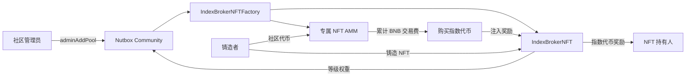

# Index Broker NFT 矿池说明

Index Broker NFT 是一种与 Nutbox 社区绑定的固定总量 NFT 矿池。每个矿池由一份 NFT 合约和一份专属 AMM 合约组成，并同时提供两套彼此独立的挖矿能力：

- **社区挖矿**：持有 NFT 即可按 NFT 推荐等级权重参与 Nutbox 社区奖励分配。
- **指数挖矿**：NFT 持有人销毁社区代币增加指数挖矿权重，按权重获得指定指数代币奖励。

每次铸造 NFT 都必须支付固定数量的社区代币。这些社区代币不会发送给项目方，也不会被销毁，而是直接进入该 NFT 矿池的专属 AMM，作为 AMM 回购 NFT 的储备。公开铸造还可以设置额外的 BNB 价格、推荐返佣和等级成长。

本文只描述合约当前提供的功能、参数和使用方式。

## 1. 系统组成

一个完整的 Index Broker NFT 矿池包含以下组件：


| 组件                          | 作用                                                                                            |
| --------------------------- | --------------------------------------------------------------------------------------------- |
| `IndexBrokerNFTFactory`     | 创建 NFT 矿池和一对一的 AMM，管理全局平台费、默认指数代币和保留名称                                                        |
| `IndexBrokerNFT`            | ERC-721 NFT、铸造、推荐升级、社区挖矿、指数挖矿、揭图和元数据入口                                                        |
| `IndexBrokerNFTAMM`         | 使用固定数量社区代币买卖 NFT，保存 NFT 库存和社区代币储备，并通过`IndexBrokerNFTPriceOracle计算价格收集原生代币手续后回购指数代币，分给NFT指数挖矿` |
| `IndexBrokerNFTPriceOracle` | 从受支持的 DEX 池读取社区代币对 BNB 的现货价格，用于计算 AMM 的 BNB 手续费                                               |
| Renderer                    | 为NFT提供SVG、`tokenURI` 和 `contractURI`；矿池创建时可选默认或自定义 Renderer                                   |


每个 NFT 矿池只对应一个 AMM，每个 AMM也只服务于一个 NFT 矿池。




## 2. 三类资产分别去了哪里


### 2.1 铸造支付的社区代币

无论白名单铸造还是公开铸造，每枚 NFT 都要支付相同数量的社区代币，即 `communityTokenPrice`。

社区代币从铸造者地址直接转入该矿池的 AMM，成为公共交易储备：

- 用户向 AMM 出售一枚 NFT 时，AMM 支付 `communityTokenPrice` 数量的社区代币。
- 用户从 AMM 买入一枚 NFT 时，向 AMM 补回同样数量的社区代币。
- `fundsReceiver`、推荐人和平台都不会收到这部分社区代币。

因此，`communityTokenPrice` 同时也是：

1. 每枚 NFT 的社区代币铸造成本；
2. AMM 买入一枚 NFT 的固定社区代币数量；
3. AMM 卖出一枚 NFT 时收取的固定社区代币数量。


### 2.2 公开铸造支付的 BNB

公开铸造必须精确支付 `nativePrice`，BNB 按以下顺序分配：

```text
平台费 = nativePrice × Factory.platformFeeBps / 10,000
推荐佣金 = (nativePrice - 平台费) × referralBps / 10,000
项目方收入 = nativePrice - 平台费 - 推荐佣金
```

- 平台费发送给该社区 Committee 当前配置的平台收款地址。
- 有有效推荐 NFT 时，推荐佣金发送给推荐 NFT 的持有人。
- 剩余 BNB 发送给 `fundsReceiver`。
- 没有推荐 NFT 时，推荐佣金为零，剩余部分全部发送给 `fundsReceiver`。

Factory 的平台费初始值为 **30 BPS（0.3%）**，平台管理员可以全局调整，因此前端应读取 `platformFeeBps()`，不要写死。

### 2.3 AMM 交易支付的 BNB

在 AMM 买卖 NFT 时，社区代币数量固定，但还要根据该数量社区代币的当前 BNB 现货价值支付 BNB 手续费。

每笔 AMM 交易的 BNB 费用由两部分组成：

- **交易费**：费率为矿池创建时设置的 `normalFeeBps` 或 `specificFeeBps`，留在 AMM 中作为指数代币回购资金。
- **平台费**：固定为 **50 BPS（0.5%）**，立即发送给平台收款地址。

设 `V` 为预言机计算出的 `communityTokenPrice` 数量社区代币的当前 BNB 价值，则：

```text
普通交易总费用 = ceil(V × normalFeeBps / 10,000) + ceil(V × 50 / 10,000)
指定 NFT 交易总费用 = ceil(V × specificFeeBps / 10,000) + ceil(V × 50 / 10,000)
```

用户多支付的 BNB 会在交易末尾自动退回。

## 3. 矿池创建规则

矿池不能直接由普通钱包调用 Factory 创建。社区管理员需要通过 Nutbox Community 的 `adminAddPool` 创建：

```solidity
community.adminAddPool{value: communitySettingsFee}(
    collectionName,
    poolRatios,
    address(indexBrokerNFTFactory),
    abi.encode(poolConfig)
);
```

创建前需要满足：

- Community 必须由 Factory 所绑定的 `CommunityFactory` 创建。
- `IndexBrokerNFTFactory` 必须已被该社区的 Committee 认可为可用 Pool Factory。
- 调用者必须是 Community 当前 owner。
- `poolRatios` 长度必须等于新增后活跃 Pool 的数量。
- `poolRatios` 总和必须为 `10,000` 或全部为 `0`。
- 调用时需要按 Community 当前 Committee 配置支付 `getCommunitySettingsFee()`；费用为 0 时无需附带 BNB。

创建成功后，Factory 会同时创建：

- NFT Pool 地址；
- 与该 NFT Pool 一一对应的 AMM 地址。

可通过 `IndexBrokerNFTCreated` 和 `IndexBrokerNFTAMMCreated` 事件获取这两个地址及主要配置。

## 4. PoolConfig 参数

`meta` 必须为 `abi.encode(PoolConfig)`。当前结构如下：

```solidity
struct PoolConfig {
    string symbol;
    address fundsReceiver;
    address renderer;
    uint256[] levelThresholds;
    uint256[] levelWeights;
    uint256 communityTokenPrice;
    uint256 indexMiningActivationTokenAmount;
    uint256 recommitPrice;
    uint256 nativePrice;
    uint256 maxSupply;
    uint16 referralBps;
    bytes ammConfig;
    bool lockWhitelistSlots;
    bool rerollEnabled;
    address[] whitelistAccounts;
    uint256[] whitelistAllowances;
}
```


### 4.1 基础参数


| 参数                                 | 含义与约束                                           |
| ---------------------------------- | ----------------------------------------------- |
| `symbol`                           | NFT 集合符号，1～16 字节                                |
| `fundsReceiver`                    | 接收公开铸造净 BNB 收入的地址，不可为零地址或 NFT Pool 自身           |
| `renderer`                         | Renderer 地址；填零地址时使用 Factory 的 `defaultRenderer` |
| `communityTokenPrice`              | 每次铸造和 AMM 买卖一枚 NFT 所使用的固定社区代币数量，必须大于 0          |
| `indexMiningActivationTokenAmount` | NFT 转移后重新激活指数挖矿时需要销毁的社区代币数量，必须大于 0              |
| `recommitPrice`                    | 重新提交揭图所需销毁的社区代币数量；仅在 `rerollEnabled=true` 时生效   |
| `nativePrice`                      | 公开铸造需要精确支付的 BNB；为 0 时矿池为纯白名单模式                  |
| `maxSupply`                        | NFT 最大供应量，必须大于 0；Token ID 从 1 开始                |
| `referralBps`                      | 推荐佣金费率，分母为 10,000；最大 10,000                     |
| `lockWhitelistSlots`               | 是否为白名单保留其分配的供应量                                 |
| `rerollEnabled`                    | NFT 揭图后是否允许付费重新生成外观                             |


名称由 `adminAddPool` 的 `collectionName` 提供，要求为 1～64 字节；`symbol` 为 1～16 字节。长度按 UTF-8 字节计算，不是按中文字符数计算。名称和符号不能包含控制字符、双引号、`&`、`<`、`>` 或反斜杠。

Factory 的保留名称采用**完整字符串、区分大小写**的精确匹配。保留名称列表可通过以下方法查询：

- `reservedCollectionNameCount()`
- `reservedCollectionNameAt(index)`
- `reservedCollectionNameHash(keccak256(bytes(name)))`

保留名称支持删除，数组使用 swap-and-pop，因此枚举顺序不保证永久稳定。

### 4.2 等级与社区挖矿权重

`levelThresholds` 和 `levelWeights` 共同定义推荐等级：

- 数组长度必须相同；
- 等级数量为 1～16；
- `levelThresholds[0]` 必须为 0；
- `levelWeights[0]` 必须大于 0；
- 后续门槛和权重都必须严格递增。

示例：

```solidity
levelThresholds = [0, 2, 4];
levelWeights    = [10_000, 12_000, 15_000];
```

表示：


| 等级  | 累计有效推荐数 | 社区挖矿权重 |
| --- | ------- | ------ |
| 1   | 0～1     | 10,000 |
| 2   | 2～3     | 12,000 |
| 3   | 4 及以上   | 15,000 |


等级、推荐数和等级权重都跟随 NFT，而不是永久绑定原持有人。

### 4.3 白名单参数

`whitelistAccounts` 与 `whitelistAllowances` 必须满足：

- 两个数组长度相同且不能为空；
- 地址不可为零地址；
- 每个额度必须大于 0；
- 同一地址不能重复；
- 总白名单额度不能超过 `maxSupply`。

`lockWhitelistSlots` 的行为：

- `true`：公开铸造最多只能使用 `maxSupply - totalWhitelistAllocation` 个名额，白名单额度会被保留。
- `false`：公开铸造可以占用尚未使用的白名单名额，白名单用户可能因总供应量耗尽而无法铸造。

当 `nativePrice == 0` 时：

- 矿池自动成为纯白名单模式；
- `referralBps` 必须为 0；
- 白名单总额度必须恰好等于 `maxSupply`；
- `lockWhitelistSlots` 会被强制视为 `true`。


### 4.4 揭图参数

- `rerollEnabled=false`：NFT 成功揭图后不能再次生成；如果初次揭图窗口过期，可以免费重新提交一次新的揭图区块。
- `rerollEnabled=true`：持有人可以在揭图后再次调用 `commitReveal`，销毁 `recommitPrice` 数量的社区代币后进入下一轮揭图。
- 当 `rerollEnabled=true` 且创建时 `recommitPrice=0`，实际价格自动使用 `communityTokenPrice`。
- 当 `rerollEnabled=false` 时，合约保存的 `recommitPrice` 为 0。


## 5. AMMConfig 参数

`PoolConfig.ammConfig` 必须为 `abi.encode(AMMConfig)`：

```solidity
struct AMMConfig {
    uint16 normalFeeBps;
    uint16 specificFeeBps;
    IIndexBrokerNFTPriceOracle.SourceType priceSourceType;
    bytes priceSourceData;
    address indexToken;
}
```


| 参数                | 含义与约束                                |
| ----------------- | ------------------------------------ |
| `normalFeeBps`    | 出售 NFT、按队首买入 NFT 时的交易费率，最大 10,000    |
| `specificFeeBps`  | 购买指定 Token ID 时的交易费率，最大 10,000       |
| `priceSourceType` | 社区代币对 BNB 的 DEX 价格源类型                |
| `priceSourceData` | 对应 DEX 价格源的 ABI 编码数据                 |
| `indexToken`      | 指数挖矿奖励代币；零地址表示使用创建当时的 Factory 默认指数代币 |


`indexToken` 必须是 `basketRegistry` 认可的 Basket。矿池创建完成后，选定的指数代币固定不变；以后 Factory 修改默认指数代币不会影响既有矿池。

## 6. 官方 Pump 代币与外部代币的 AMM 激活规则

Factory 通过 `Pump.createdTokens(communityToken)` 判断社区代币类型。

### 6.1 官方 Pump 代币

官方 Pump 代币的价格源只能由合约根据该代币的 PancakeSwap V4 上市信息自动读取，创建者不能手工指定 DEX 池。

创建配置要求：

```solidity
ammConfig.priceSourceData = bytes("");
```

`priceSourceType` 在 AMM 尚未激活时没有报价含义；激活后会被设置为 `PANCAKE_V4_CL`。

根据代币是否已经上市，有两种结果：

1. **创建 NFT 矿池时已经上市**
  Factory 在创建过程中读取代币保存的 V4 PoolKey，验证池子和流动性，AMM 创建后立即处于 `active=true`。
2. **创建 NFT 矿池时尚未上市**
  AMM 创建后处于 `active=false`。NFT 仍然可以正常铸造，每次铸造支付的社区代币继续进入 AMM 储备。代币上市后，任何地址都可以调用：
   `activate()` 不接收池地址或价格源参数。合约会自动读取官方代币保存的：
  - `clPoolManager`
  - `listingHook`
  - `LISTING_LP_FEE`
  - `listingPoolParameters`
  - `v4PoolId`
   只有重建出的 Pool ID 与代币保存的 `v4PoolId` 一致、池已初始化且有有效流动性时，AMM 才会激活。

激活是公开操作，但调用者不能替换官方价格源，也不会因为激活而获得矿池管理权限。

### 6.2 外部导入代币

不属于当前 Factory 所绑定 Pump 的代币被视为外部代币。外部代币必须在创建 NFT 矿池时直接提供有效 DEX 价格源：

```solidity
ammConfig.priceSourceData = abi.encode(...);
```

如果价格源为空，创建会失败。价格源验证成功后，外部代币的 AMM 在创建交易内直接激活。外部代币不能使用官方代币的无参数 `activate()` 流程。

### 6.3 AMM 未激活时可以做什么

AMM 未激活只限制 AMM 二级交易，不会暂停 NFT Pool 本身。


| 功能                  | 未激活时是否可用                          |
| ------------------- | --------------------------------- |
| NFT 铸造              | 可用，只要 Community 中该 Pool 仍为 active |
| 社区代币进入 AMM 储备       | 可用，每次铸造照常转入                       |
| 社区挖矿                | 可用                                |
| 指数挖矿升级、激活、领奖        | 可用                                |
| 揭图、重新提交             | 可用                                |
| AMM 报价              | 不可用                               |
| 向 AMM 出售 NFT        | 不可用                               |
| 从 AMM 购买 NFT        | 不可用                               |
| 使用 AMM BNB 储备购买指数代币 | 不可用                               |
| 直接向 AMM 发送 BNB      | 不可用，普通转账会回滚                       |


AMM 激活后不可再次激活，也没有停用或更换价格源的用户入口。

## 7. 支持的 DEX 价格源

`SourceType` 枚举值：


| 枚举值 | 类型              | `priceSourceData` 编码            |
| --- | --------------- | ------------------------------- |
| 0   | `V2_PAIR`       | `abi.encode(factory, pair)`     |
| 1   | `V3_POOL`       | `abi.encode(factory, pool)`     |
| 2   | `UNISWAP_V4`    | `abi.encode(UniswapV4Source)`   |
| 3   | `PANCAKE_V4_CL` | `abi.encode(PancakeV4CLSource)` |


V4 结构：

```solidity
struct UniswapV4Source {
    address poolManager;
    address currency0;
    address currency1;
    uint24 fee;
    int24 tickSpacing;
    address hooks;
}

struct PancakeV4CLSource {
    address currency0;
    address currency1;
    address hooks;
    address poolManager;
    uint24 fee;
    bytes32 parameters;
}
```

价格源需要满足：

- Factory 或 Pool Manager 已被共享 Oracle 列入允许列表；
- 交易对的一侧是社区代币；
- 另一侧是 Wrapped Native，V4 还允许原生币地址 `address(0)`；
- 池地址、Factory 和 Pool ID 相互匹配；
- 池已初始化；
- 储备或当前有效流动性不为 0。

Oracle 使用 DEX 的**当前现货价格**。前端应在发送交易前重新调用 AMM 报价函数；当池价或有效流动性变化时，BNB 手续费也会立即变化。如果价格源暂时没有有效流动性，依赖报价的 AMM 操作会回滚。

## 8. 铸造 NFT


### 8.1 授权

铸造前，用户需要授权 NFT Pool 合约从自己的地址转走至少 `communityTokenPrice` 数量的社区代币：

```solidity
communityToken.approve(address(nftPool), communityTokenPrice);
```

注意：spender 是 **NFT Pool 地址**，不是 AMM 地址。NFT Pool 会把代币直接转入 AMM。

### 8.2 调用

```solidity
uint256 tokenId = nftPool.mint{value: bnbAmount}(referrerTokenId);
```

- `referrerTokenId == 0` 表示没有推荐人。
- 白名单用户额度尚未用完时自动走白名单路径。
- 非白名单用户或白名单额度已用完的用户走公开铸造路径。


### 8.3 白名单铸造

白名单铸造：

- 仍需支付 `communityTokenPrice` 数量的社区代币；
- 不需要支付 `nativePrice` BNB；
- 即使发送了 BNB，也会原路退回；
- 忽略传入的 `referrerTokenId`；
- 不增加任何推荐 NFT 的推荐数，也不产生推荐佣金。


### 8.4 公开铸造

公开铸造：

- 必须精确发送 `nativePrice`；少 1 wei 或多 1 wei 都会回滚；
- 同时支付 `communityTokenPrice` 数量的社区代币；
- 可以使用一个当前不在 AMM 库存中的有效推荐 NFT；
- 受 `maxSupply` 和 `lockWhitelistSlots` 限制。


### 8.5 铸造后的初始状态

新 NFT：

- 等级为 1；
- 社区挖矿立即生效，权重为 `levelWeights[0]`；
- 指数挖矿状态为 active，但初始指数挖矿权重为 0；
- 初始 `seed` 为 0，显示未揭图样式；
- 自动创建第 1 轮揭图任务。


## 9. 推荐、等级与社区挖矿


### 9.1 推荐规则

只有公开铸造会记录推荐关系。有效推荐发生时：

1. 推荐 NFT 的 `referralCount` 增加 1；
2. 推荐 NFT 当前持有人获得推荐佣金；
3. 如果推荐数达到新等级门槛，推荐 NFT 自动升级；
4. NFT 的社区挖矿权重同步增加。

处于 AMM 库存中的 NFT 不能作为推荐 NFT。

### 9.2 社区挖矿

社区挖矿奖励由 Nutbox Community 计算和发放，Index Broker NFT 只向 Community 提供用户权重。

- 钱包持有 NFT 时，该 NFT 的等级权重计入持有人的总权重。
- 普通钱包之间转移 NFT 时，完整等级权重转移给新持有人。
- NFT 进入 AMM 库存时，其社区挖矿权重暂时从总权重中移除。
- NFT 离开 AMM 后，完整等级权重恢复到新持有人名下。
- NFT 的等级不会因为转移或进入 AMM 而降低。

常用查询：

```solidity
nftPool.miningWeightOf(tokenId);
nftPool.activeMiningWeightOf(tokenId);
nftPool.getUserStakedAmount(user);
nftPool.getTotalStakedAmount();
community.getPoolPendingRewards(address(nftPool), user);
```

社区奖励通过 Community 领取，而不是通过 NFT 的 `claimIndexRewards`：

```solidity
address[] memory pools = new address[](1);
pools[0] = address(nftPool);
uint256 operationFee = committee.getPoolOperationFee();
community.withdrawPoolsRewards{value: operationFee}(pools);
```

领取时是否需要支付 Community 配置的操作费，以对应 Committee 的当前设置为准。

## 10. 指数挖矿

指数挖矿奖励代币为矿池创建时固定的 `indexToken`，与社区挖矿奖励是两套独立资产和独立会计。

### 10.1 增加指数挖矿权重

NFT 持有人调用：

```solidity
nftPool.upgradeIndexMining(tokenId, tokenAmount);
```

要求：

- 调用者是 NFT 当前持有人；
- NFT 的指数挖矿处于 active；
- `tokenAmount` 至少为一个完整社区代币，即 `10 ** communityToken.decimals()`；
- 用户已授权 NFT Pool 使用对应数量的社区代币。

`tokenAmount` 会被发送到固定销毁地址 `0x000000000000000000000000000000000000dEaD`，并按 1:1 增加该 NFT 的指数挖矿权重。该销毁不可撤销。

### 10.2 NFT 转移对指数挖矿的影响

每次 ERC-721 转移都会：

1. 结算 NFT 已产生但尚未领取的指数奖励；
2. 将 NFT 从 active 指数挖矿总权重中移除；
3. 把现有指数挖矿权重保留为原来的 **80%**；
4. 如果保留后的权重不足一个完整社区代币，则直接归零；
5. 将指数挖矿状态设置为 inactive。

这条规则适用于普通转账，也适用于 NFT 进入或离开 AMM。一次完整的“卖给 AMM，再从 AMM 买出”包含两次 ERC-721 转移，因此指数权重会连续执行两次 80% 保留。

已经结算到 NFT 的 `pendingIndexRewards` 会随 NFT 一起转移，新持有人可以领取。

### 10.3 重新激活指数挖矿

转移后的新持有人调用：

```solidity
nftPool.activateIndexMining(tokenId);
```

合约会销毁固定的 `indexMiningActivationTokenAmount` 数量社区代币，并重新激活 NFT 当前保留下来的指数权重。

重新激活不会自动增加新权重。如果 NFT 权重已经归零，需要在激活后再调用 `upgradeIndexMining` 增加权重。

### 10.4 指数奖励注入与分配

任何地址都可以向矿池注入指定的指数代币：

```solidity
indexToken.approve(address(nftPool), amount);
nftPool.injectIndexRewards(amount);
```

奖励按所有 active NFT 的指数挖矿权重比例分配：

```text
某 NFT 奖励占比 = 该 NFT active 指数权重 / 全部 active 指数权重
```

如果注入时没有任何 active 指数权重，奖励进入 `queuedIndexRewards`。当后续出现有效 active 权重或再次注入时，队列奖励按届时的 active 权重分配。

NFT 当前持有人领取：

```solidity
uint256 amount = nftPool.claimIndexRewards(tokenId);
```

常用查询：

```solidity
nftPool.indexMiningActiveOf(tokenId);
nftPool.indexMiningWeightOf(tokenId);
nftPool.activeIndexMiningWeightOf(tokenId);
nftPool.pendingIndexRewardsOf(tokenId);
nftPool.totalActiveIndexMiningWeight();
nftPool.queuedIndexRewards();
```

### 10.5 指数代币 Holder Fee 回收

回购得到的 `indexToken` 在用户领取之前由 NFT Pool 持有，因此会在 Index Basket 中累积属于 NFT Pool 的 Holder Fee。任何地址都可以调用：

```solidity
uint256 wrappedNativeAmount = nftPool.harvestIndexHolderFees();
```

该操作会原子完成：

1. 从固定的 `indexToken` 领取属于 NFT Pool 的 Holder Fee；
2. 将收到的 WBNB 转入配套 AMM；
3. AMM 将 WBNB 解包为 BNB；
4. BNB 与 AMM 交易费进入同一回购储备，后续由 `buyIndexWithNativeReserve(...)` 统一回购指数代币。

调用者不能指定领取地址、WBNB 地址或 AMM 地址。没有可领取 Holder Fee 时交易会回滚。Keeper 可以在同一笔组合交易中先领取 Holder Fee，再执行回购并获得回购流程的 1% 执行奖励。


## 11. 揭图与重新生成

NFT 铸造时先显示未揭图图像。每轮揭图使用未来区块的 `blockhash` 生成链上 seed。

### 11.1 初次揭图

铸造时合约记录：

```text
revealBlock = 铸造区块 + 3
```

必须等链上区块高度**超过** `revealBlock` 后才能调用：

```solidity
uint256 seed = nftPool.reveal(tokenId);
```

有效窗口截止到 `revealBlock + 256`。只有 NFT 当前持有人可以揭图。

### 11.2 揭图窗口过期

如果错过窗口，当前 pending 任务不能再直接 `reveal`。持有人需要调用：

```solidity
nftPool.commitReveal(tokenId);
```

合约会创建新的未来揭图区块：

- 允许 reroll 的矿池会销毁 `recommitPrice` 数量社区代币；
- 不允许 reroll 的矿池，只能为已过期且尚未成功揭图的 NFT 免费重新提交。


### 11.3 已揭图 NFT 重新生成

仅当 `rerollEnabled=true` 时，已揭图 NFT 才能调用 `commitReveal`。重新提交后，旧 seed 和旧图像会保留，直到新一轮 `reveal` 成功后再替换。

可通过 `getNFTInfo(tokenId)` 查看：

- `seed`
- `revealBlock`
- `revealRound`
- `revealPending`


## 12. NFT AMM 交易

AMM 使用固定社区代币数量交易 NFT，并按进入库存的先后顺序维护 FIFO 队列。

### 12.1 向 AMM 出售 NFT

先授权 AMM 操作 NFT：

```solidity
nftPool.approve(address(amm), tokenId);
```

读取当前费用并出售：

```solidity
uint256 fee = amm.quoteNormalNativeFee();
amm.sellNFT{value: fee}(tokenId);
```

成功后：

- NFT 进入 AMM 库存尾部；
- 卖家收到 `communityTokenPrice` 数量的社区代币；
- 普通交易费留在 AMM；
- 固定 0.5% 平台费发送给平台；
- NFT 社区挖矿在 AMM 托管期间暂停；
- NFT 指数挖矿被停用，指数权重按转移规则保留 80%。

只有 AMM 的 `sellNFT` 流程可以把本集合 NFT 转入 AMM，直接 `transferFrom` 到 AMM 会回滚。

### 12.2 按队首买入 NFT

```solidity
uint256 tokenId = amm.oldestTokenId();
uint256 fee = amm.quoteNormalNativeFee();

communityToken.approve(address(amm), communityTokenPrice);
uint256 purchasedId = amm.buyNextNFT{value: fee}();
```

`buyNextNFT` 在交易执行时读取当前队首，并使用 `normalFeeBps`。

### 12.3 购买指定 NFT

```solidity
uint256 fee = amm.quoteSpecificNativeFee();

communityToken.approve(address(amm), communityTokenPrice);
amm.buySpecificNFT{value: fee}(tokenId);
```

要求该 Token ID 当前在 AMM 库存中，并使用 `specificFeeBps`。

这两种购买都要传入value参数，前端应该实时读取价格计算value的值，并且给一定的滑点，也就是maxFee应该要稍大于实际消耗的fee

### 12.4 库存查询

```solidity
amm.inventoryCount();
amm.oldestTokenId();
amm.newestTokenId();
amm.inInventory(tokenId);
amm.nextInventoryToken(tokenId);
amm.previousInventoryToken(tokenId);
```

`nextInventoryToken` 和 `previousInventoryToken` 只接受当前仍在库存中的 Token ID。

### 12.5 交易前检查

前端每次交易前应重新读取：

```solidity
amm.active();
amm.quoteNativeValue();
amm.quoteNormalNativeFee();
amm.quoteSpecificNativeFee();
communityToken.balanceOf(address(amm));
```

卖出 NFT 时，如果 AMM 的社区代币储备不足以支付一枚 NFT，交易会回滚。买入时需要给 AMM 授权精确的固定社区代币金额；不支持转账扣税导致 AMM 实际到账不足的代币。

## 13. AMM BNB 储备与指数代币回购

普通 AMM 交易费留在 AMM 中。任何地址都可以执行：

```solidity
amm.buyIndexWithNativeReserve(
    minSettlementOut,
    minIndexOut,
    hookData
);
```

执行流程：

1. 读取 AMM 当前全部 BNB 余额；
2. 将余额的 **100 BPS（1%）** 发送给执行者作为执行奖励；
3. 其余 BNB 通过固定 Pancake V3 路径换成 Basket Router 的结算代币；
4. 再用结算代币购买该矿池固定的 `indexToken`；
5. 将买到的指数代币注入 NFT Pool，按指数挖矿权重分配。

NFT Pool 持有指数代币期间产生的 Index Basket Holder Fee，也可以通过 `harvestIndexHolderFees()` 转成 BNB 并加入这里的同一储备。AMM 不区分 BNB 来自 NFT 交易费还是 Index Holder Fee。

`minSettlementOut`、`minIndexOut` 和 `hookData` 由执行者提供。执行者或 Keeper 应先使用对应 Router 的最新报价生成合理的最小输出和 Basket Hook 数据，避免使用过期参数。

AMM 没有管理员提取社区代币储备或 BNB 交易费的普通入口：

- 社区代币储备用于固定价格 NFT 买卖；
- BNB 交易费通过上述公开回购流程转换为指数挖矿奖励。


## 14. 元数据与 Renderer

NFT 的元数据完全由 Renderer 根据链上状态生成：

```solidity
nftPool.tokenURI(tokenId);
nftPool.tokenSVG(tokenId);
nftPool.contractURI();
```

Renderer 接收的主要数据包括：

- 集合名称和 Token ID；
- 揭图 seed；
- 等级、推荐数和推荐 NFT；
- 社区挖矿权重与状态；
- 指数挖矿权重与状态。

目录内提供两种 Renderer：

- `IndexBrokerNFTRenderer`：黑金 BSC 赛博矿卡风格；
- `StonkBrokerRenderer`：全链上像素 Broker 风格，并根据指数挖矿权重显示动态徽章。

`seed == 0` 时 Renderer 显示未揭图状态。等级、推荐数、挖矿状态或指数权重变化时，NFT 合约会发出 ERC-4906 `MetadataUpdate(tokenId)`，前端和 NFT 市场可以据此刷新元数据。

Renderer 在矿池创建时确定，NFT Pool 没有后续修改 Renderer 的管理函数。

## 15. 管理权限


### 15.1 Community 管理员

- 通过 `Community.adminAddPool` 创建 NFT 矿池；
- 设置或调整各 Nutbox Pool 的奖励比例；
- 可以通过 Community 关闭 Pool。

NFT 的 `mint` 会检查该 Pool 在 Community 中是否仍为 active。关闭后不能继续铸造，但 AMM 的 `active` 状态独立，不会因为 Community 关闭而自动改变。

### 15.2 NFT Pool owner

创建时，Community 当前 owner 成为 NFT Pool owner。NFT Pool owner可以：

- 调用 `setFundsReceiver(newReceiver)` 修改以后公开铸造的净 BNB 收款地址；
- 使用 Ownable2Step 流程转移 NFT Pool 所有权。

NFT Pool owner 不能修改：

- 最大供应量；
- 铸造价格；
- 白名单；
- 推荐费率和等级配置；
- AMM 费率和价格源；
- 指数代币；
- Renderer。


### 15.3 Factory owner

Factory owner可以：

- 调整所有矿池公开铸造所读取的 `platformFeeBps`；
- 修改以后新建矿池使用的默认指数代币；
- 添加或删除精确匹配的保留集合名称。

修改默认指数代币不会改变既有矿池的 `indexToken`。

### 15.4 公开操作

以下操作不需要管理员权限：

- 官方代币上市后的 `amm.activate()`；
- `injectIndexRewards(amount)`；
- `harvestIndexHolderFees()`；
- `buyIndexWithNativeReserve(...)`；
- 正常铸造、揭图、挖矿升级、领取和 AMM 买卖。


## 16. 主要查询接口


### 16.1 NFT Pool


| 接口                                      | 返回内容                            |
| --------------------------------------- | ------------------------------- |
| `getNFTInfo(tokenId)`                   | owner、等级、推荐、两套挖矿状态、待领取指数奖励和揭图状态 |
| `tokensOfOwner(account, offset, limit)` | 分页查询地址持有的 Token ID              |
| `remainingWhitelistMints(account)`      | 地址剩余白名单额度                       |
| `remainingPaidMints()`                  | 当前剩余公开铸造数量                      |
| `miningWeightOf(tokenId)`               | NFT 等级对应的社区挖矿权重                 |
| `activeMiningWeightOf(tokenId)`         | 当前实际生效的社区挖矿权重                   |
| `indexMiningWeightOf(tokenId)`          | NFT 保存的指数挖矿权重                   |
| `activeIndexMiningWeightOf(tokenId)`    | 当前实际生效的指数挖矿权重                   |
| `pendingIndexRewardsOf(tokenId)`        | 当前可领取的指数代币奖励                    |
| `harvestIndexHolderFees()`              | 领取 Index Holder Fee 并转成 AMM BNB 储备   |
| `platformFeeReceiver()`                 | 当前平台费接收地址                       |
| `platformFeeBps()`                      | 当前公开铸造平台费率                      |


### 16.2 AMM


| 接口                                        | 返回内容                 |
| ----------------------------------------- | -------------------- |
| `active()`                                | AMM 是否已激活            |
| `tokensPerNFT()`                          | 买卖一枚 NFT 的固定社区代币数量   |
| `quoteNativeValue()`                      | 固定社区代币数量的当前 BNB 现货价值 |
| `quoteNormalNativeFee()`                  | 普通买卖所需 BNB 总费用       |
| `quoteSpecificNativeFee()`                | 购买指定 NFT 所需 BNB 总费用  |
| `quotePlatformNativeFee()`                | 单笔 AMM 交易的平台费        |
| `inventoryCount()`                        | AMM 当前 NFT 库存数量      |
| `oldestTokenId()`                         | 当前队首 Token ID        |
| `newestTokenId()`                         | 当前队尾 Token ID        |
| `priceSourceType()` / `priceSourceData()` | 激活后的 DEX 报价源         |


## 17. 主要事件

前端和索引服务建议至少监听：

### Factory

- `IndexBrokerNFTCreated`
- `IndexBrokerNFTAMMCreated`


### NFT Pool

- `NFTMinted`
- `NFTReferralRecorded`
- `NFTLevelUp`
- `RevealCommitted`
- `NFTRevealed`
- `MiningWeightMoved`
- `IndexMiningActivated`
- `IndexMiningDeactivated`
- `IndexMiningWeightUpgraded`
- `IndexMiningWeightReduced`
- `IndexRewardsInjected`
- `IndexRewardsClaimed`
- `IndexHolderFeesHarvested`
- `MetadataUpdate`


### AMM

- `AMMActivated`
- `NFTSold`
- `NFTBought`
- `PlatformFeePaid`
- `NativeFeeRefunded`
- `IndexHolderFeesConverted`
- `IndexTokenPurchased`


## 18. 创建示例

以下示例展示外部社区代币使用 V2 价格源创建矿池。参数仅用于说明编码方式，应根据实际项目配置：

```solidity
uint256[] memory thresholds = new uint256[](3);
thresholds[0] = 0;
thresholds[1] = 2;
thresholds[2] = 4;

uint256[] memory weights = new uint256[](3);
weights[0] = 10_000;
weights[1] = 12_000;
weights[2] = 15_000;

address[] memory whitelist = new address[](2);
whitelist[0] = userA;
whitelist[1] = userB;

uint256[] memory allowances = new uint256[](2);
allowances[0] = 2;
allowances[1] = 1;

IndexBrokerNFTFactory.AMMConfig memory ammConfig =
    IndexBrokerNFTFactory.AMMConfig({
        normalFeeBps: 100,       // 1%
        specificFeeBps: 300,     // 3%
        priceSourceType: IIndexBrokerNFTPriceOracle.SourceType.V2_PAIR,
        priceSourceData: abi.encode(v2Factory, v2Pair),
        indexToken: address(0)    // 使用创建当时的 Factory 默认指数代币
    });

IndexBrokerNFTFactory.PoolConfig memory config =
    IndexBrokerNFTFactory.PoolConfig({
        symbol: "IDXNFT",
        fundsReceiver: projectTreasury,
        renderer: address(0),
        levelThresholds: thresholds,
        levelWeights: weights,
        communityTokenPrice: 1_000 ether,
        indexMiningActivationTokenAmount: 100 ether,
        recommitPrice: 200 ether,
        nativePrice: 0.01 ether,
        maxSupply: 1_000,
        referralBps: 1_000,      // 扣除平台费后金额的 10%
        ammConfig: abi.encode(ammConfig),
        lockWhitelistSlots: true,
        rerollEnabled: true,
        whitelistAccounts: whitelist,
        whitelistAllowances: allowances
    });

// ratios 需要覆盖新增后的全部 active Pools，且总和为 10,000 或 0。
community.adminAddPool{value: communitySettingsFee}(
    "Example Index Broker NFT",
    ratios,
    address(indexBrokerNFTFactory),
    abi.encode(config)
);
```

示例中的 `ether` 仅表示 18 位精度的 ERC-20 数量。若社区代币不是 18 位精度，应按该代币的 `decimals()` 换算所有社区代币参数。

官方 Pump 代币尚未上市时，AMMConfig 的区别是价格源数据必须为空：

```solidity
IndexBrokerNFTFactory.AMMConfig memory ammConfig =
    IndexBrokerNFTFactory.AMMConfig({
        normalFeeBps: 100,
        specificFeeBps: 300,
        priceSourceType: IIndexBrokerNFTPriceOracle.SourceType.PANCAKE_V4_CL,
        priceSourceData: bytes(""),
        indexToken: address(0)
    });
```

代币上市后，任意 Keeper 或普通用户调用 `amm.activate()` 即可开启 AMM。

## 19. 前端接入建议


### 创建页

- 明确显示社区代币铸造成本和公开铸造 BNB 价格是两笔独立支付。
- 校验等级门槛、权重和白名单数组。
- 根据 `Pump.createdTokens(communityToken)` 自动切换官方代币与外部代币配置表单。
- 官方未上市代币不要求用户填写 DEX 池；外部代币必须填写并预验证价格源。
- 显示 `indexToken` 的实际选定地址，不只显示“默认”。


### 铸造页

- 先判断用户是否仍有白名单额度。
- 白名单路径发送 0 BNB，并把推荐 NFT 视为无效。
- 公开路径必须发送精确 `nativePrice`。
- 两种路径都要检查社区代币余额和对 NFT Pool 的 allowance。


### AMM 页面

- 未激活时隐藏交易按钮，显示“等待官方代币上市/等待公开激活”。
- 官方代币上市后允许任何钱包触发 `activate()`。
- 每次提交交易前重新读取费用，避免使用缓存现货价格。
- `buyNextNFT` 展示的是当前队首；如果用户要求确定 Token ID，应使用 `buySpecificNFT`。
- 卖出前检查 AMM 社区代币储备，买入前检查 allowance。
- 明确提示 AMM 交易属于 NFT 转移，会停用指数挖矿并衰减权重。


### NFT 详情页

- 分开展示“社区挖矿权重”和“指数挖矿权重”。
- 展示指数挖矿是否 active、转移后的剩余权重和重新激活成本。
- 展示 `pendingIndexRewards`、`revealBlock`、`revealRound` 和揭图截止区块。
- 使用 ERC-4906 `MetadataUpdate` 刷新图片和属性。


## 20. 重要使用规则汇总

1. 白名单只免除 BNB，**不免除社区代币铸造成本**。
2. 铸造支付的社区代币进入 AMM 公共储备，不进入项目方钱包。
3. 社区挖矿与指数挖矿互相独立，领取入口也不同。
4. 任意 NFT 转移都会停用指数挖矿，并把指数权重衰减为原来的 80%。
5. AMM 中的 NFT 不参与社区挖矿，也不能作为推荐 NFT。
6. AMM 的社区代币成交数量固定，BNB 手续费随 DEX 现货价格变化。
7. 官方 Pump 代币可以在上市前创建矿池并正常铸造，AMM 交易需等上市后公开激活。
8. 外部代币必须在创建矿池时提供有效 DEX 价格源，并立即激活 AMM。
9. 指数代币、Renderer、AMM 费率和激活后的价格源在矿池创建后不能由 Pool owner 修改。
10. 社区代币应支持精确 ERC-20 转账；扣税或短到账代币会使铸造、挖矿升级或 AMM 交易回滚。
11. 揭图依赖有限的未来区块窗口，前端应提醒持有人及时操作。
12. 不要直接向 NFT Pool、AMM 或销毁地址转账来代替合约函数；直接转账不会产生个人份额或额外权益。

## 21. BSC 主网部署顺序

部署前先在最新 BSC 状态上运行全部 fork 测试：

```bash
BSC_RPC_URL=$BSC_RPC_URL FOUNDRY_PROFILE=fork \
forge test --rpc-url $BSC_RPC_URL --match-path 'test/fork/BSC*.t.sol' -vv
```

先模拟部署新版 Pump、Token implementation 和 Hook。模拟不会写入任何地址文件：

```bash
forge script script/DeployBSCPumpRefresh.s.sol \
  --rpc-url $BSC_RPC_URL --chain-id 56 -vv
```

模拟成功后再广播。`PUMP_OWNER` 应填写最终管理地址；只有广播时才设置 `WRITE_DEPLOYMENTS=true`，成功后生成独立的 `deployments/56/pump-refresh.json` 候选记录，不会覆盖现网的 `addresses.json`：

```bash
PUMP_OWNER=$PUMP_OWNER WRITE_DEPLOYMENTS=true \
forge script script/DeployBSCPumpRefresh.s.sol \
  --rpc-url $BSC_RPC_URL --chain-id 56 --broadcast --legacy \
  --verify --etherscan-api-key $BSCSCAN_API_KEY -vv
```

取得新版 Pump 地址后，先模拟部署 Index Broker NFT 合约组：

```bash
BSC_PUMP=$NEW_PUMP INDEX_BROKER_OWNER=$INDEX_BROKER_OWNER \
forge script script/DeployBSCIndexBrokerNFT.s.sol \
  --rpc-url $BSC_RPC_URL --chain-id 56 -vv
```

模拟成功后再广播，并生成独立的 `deployments/56/index-broker-nft.json`：

```bash
BSC_PUMP=$NEW_PUMP INDEX_BROKER_OWNER=$INDEX_BROKER_OWNER WRITE_DEPLOYMENTS=true \
forge script script/DeployBSCIndexBrokerNFT.s.sol \
  --rpc-url $BSC_RPC_URL --chain-id 56 --broadcast --legacy \
  --verify --etherscan-api-key $BSCSCAN_API_KEY -vv
```

广播后还必须完成以下确认，才可把候选地址合并进正式地址记录并发布版本：

1. `PUMP_OWNER` 和 `INDEX_BROKER_OWNER` 分别执行 `acceptOwnership()`（若与部署者不同）。
2. Committee 中 `verifyContract(IndexBrokerNFTFactory)` 返回 `true`；若部署者不是 Committee owner，需要由 Committee owner 执行 `adminAddContract(factory)`。
3. 新 Pump 的 PoolManager、Vault、Hook、Calculator 和 Nutbox 地址与部署记录一致，Hook 地址低 16 位符合 `0x0cc1` 权限位图。
4. Factory 的默认指数代币为 `0xcF99DeC9439630ccf7Efe392F0fc2aF98EF99a61`，并且 BasketRegistry 仍将其识别为有效 Basket。
5. 完成一次小额 Token 创建/上市/双向交易/`collectFees()`，以及一次 NFT 创建、铸造、AMM 交易、指数回购、奖励领取的主网烟雾测试。
6. 确认前端、API 和 Subgraph 使用新 Pump、Hook 和 IndexBrokerNFTFactory 地址后，再推送提交和创建版本标签。
