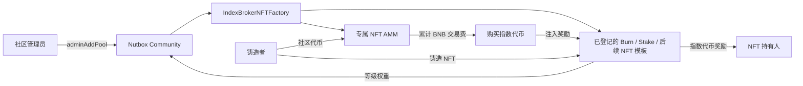

# Index Broker NFT 矿池说明

Index Broker NFT 是一种与 Nutbox 社区绑定的固定总量 NFT 矿池。每个矿池由一份 NFT 合约和一份专属 AMM 合约组成，并同时提供两套彼此独立的挖矿能力：

- **社区挖矿**：持有 NFT 即可按 NFT 推荐等级权重参与 Nutbox 社区奖励分配。
- **指数挖矿**：创建矿池时选择销毁型或质押型 NFT 模板，持有人按对应规则增加权重并获得指定指数代币奖励。

每次铸造 NFT 都必须支付固定数量的社区代币。这些社区代币不会发送给项目方，也不会被销毁，而是直接进入该 NFT 矿池的专属 AMM，作为 AMM 回购 NFT 的储备。公开铸造还可以设置额外的 BNB 价格、推荐返佣和等级成长。

本文只描述合约当前提供的功能、参数和使用方式。

## 1. 系统组成

一个完整的 Index Broker NFT 矿池包含以下组件：


| 组件                          | 作用                                                                                            |
| --------------------------- | --------------------------------------------------------------------------------------------- |
| `IndexBrokerNFTFactory`     | 管理可用 NFT 模板，创建 NFT 矿池和一对一的 AMM，并管理全局平台费、默认指数代币、Basket 版本 Router 和保留名称                         |
| `IndexBrokerNFTBase`        | 两类 NFT 模板共享的 ERC-721、铸造、推荐升级、社区挖矿、奖励注入、揭图和元数据逻辑                                           |
| `IndexBrokerNFTBurn`        | 销毁型模板；销毁社区代币增加指数权重，转移后保留 80% 并需要重新激活                                                        |
| `IndexBrokerNFTStake`       | 质押型模板；质押创建者指定的 ERC-20 增加指数权重，本金、权重和奖励跟随 NFT，转移不衰减                                         |
| `IndexBrokerNFTAMM`         | 使用固定数量社区代币买卖 NFT，保存 NFT 库存和社区代币储备，并固化所选指数代币版本及其 BasketSwapRouter，用 BNB 储备回购指数奖励              |
| [`NutboxRouter`](../../../router/README.md) | 平台级公共询价与交易路由；由平台登记共享价格池并维护最多五跳、可双向使用的默认路径，任何合约或账户均可使用 |
| Renderer                    | 为NFT提供SVG、`tokenURI` 和 `contractURI`；矿池创建时可选默认或自定义 Renderer                                   |


每个 NFT 矿池只对应一个 AMM，每个 AMM也只服务于一个 NFT 矿池。




## 2. 三类资产分别去了哪里


### 2.1 铸造支付的社区代币

无论白名单铸造还是公开铸造，每枚 NFT 都要支付相同数量的社区代币，即 `communityTokenPrice`。

社区代币从铸造者地址直接转入该矿池的 AMM，成为公共交易储备：

- 用户向 AMM 出售一枚 NFT 时，AMM 支付 `communityTokenPrice` 数量的社区代币。
- 用户从 AMM 买入一枚 NFT 时，向 AMM 补回同样数量的社区代币。
- `fundsReceiver`、推荐人和平台都不会收到这部分社区代币。

因此，`communityTokenPrice` 同时也是：

1. 每枚 NFT 的社区代币铸造成本；
2. AMM 买入一枚 NFT 的固定社区代币数量；
3. AMM 卖出一枚 NFT 时收取的固定社区代币数量。


### 2.2 公开铸造支付的 BNB

公开铸造必须精确支付 `nativePrice`，BNB 按以下顺序分配：

```text
平台费 = nativePrice × Factory.platformFeeBps / 10,000
推荐佣金 = (nativePrice - 平台费) × referralBps / 10,000
项目方收入 = nativePrice - 平台费 - 推荐佣金
```

- 平台费发送给该社区 Committee 当前配置的平台收款地址。
- 有有效推荐 NFT 时，推荐佣金发送给推荐 NFT 的持有人。
- 剩余 BNB 发送给 `fundsReceiver`；创建时将 `fundsReceiver` 设为零地址，表示由 Factory 自动替换为该矿池的配套 AMM 地址。
- 没有推荐 NFT 时，推荐佣金为零，剩余部分全部发送给最终生效的 `fundsReceiver`。当接收方为配套 AMM 时，这部分 BNB 直接成为指数回购储备。

Factory 的平台费初始值为 **30 BPS（0.3%）**，平台管理员可以全局调整，因此前端应读取 `platformFeeBps()`，不要写死。

### 2.3 AMM 交易支付的 BNB

在 AMM 买卖 NFT 时，社区代币数量固定，但还要根据该数量社区代币的当前 BNB 现货价值支付 BNB 手续费。

每笔 AMM 交易的 BNB 费用由两部分组成：

- **交易费**：费率为矿池创建时设置的 `normalFeeBps` 或 `specificFeeBps`，留在 AMM 中作为指数代币回购资金。
- **平台费**：固定为 **50 BPS（0.5%）**，立即发送给平台收款地址。

设 `V` 为预言机计算出的 `communityTokenPrice` 数量社区代币的当前 BNB 价值，则：

```text
普通交易总费用 = ceil(V × normalFeeBps / 10,000) + ceil(V × 50 / 10,000)
指定 NFT 交易总费用 = ceil(V × specificFeeBps / 10,000) + ceil(V × 50 / 10,000)
```

用户多支付的 BNB 会在交易末尾自动退回。

## 3. 矿池创建规则

矿池不能直接由普通钱包调用 Factory 创建。社区管理员需要通过 Nutbox Community 的 `adminAddPool` 创建：

```solidity
community.adminAddPool{value: communitySettingsFee}(
    collectionName,
    poolRatios,
    address(indexBrokerNFTFactory),
    abi.encode(poolConfig)
);
```

创建前需要满足：

- Community 必须由 Factory 所绑定的 `CommunityFactory` 创建。
- `IndexBrokerNFTFactory` 必须已被该社区的 Committee 认可为可用 Pool Factory。
- 调用者必须是 Community 当前 owner。
- `poolRatios` 长度必须等于新增后活跃 Pool 的数量。
- `poolRatios` 总和必须为 `10,000` 或全部为 `0`。
- 调用时需要按 Community 当前 Committee 配置支付 `getCommunitySettingsFee()`；费用为 0 时无需附带 BNB。

创建成功后，Factory 会同时创建：

- NFT Pool 地址；
- 与该 NFT Pool 一一对应的 AMM 地址。

可通过 `IndexBrokerNFTCreated` 和 `IndexBrokerNFTAMMCreated` 事件获取这两个地址及主要配置。

Factory owner 可以动态添加或删除 NFT 模板。模板名单的变化只影响之后创建的新矿池；已经创建的 EIP-1167 clone 永久指向创建时选择的实现，不会因为模板被删除而改变。创建者只能选择 `supportedNFTTemplate(template) == true` 的模板。

## 4. PoolConfig 参数

`meta` 必须为 `abi.encode(PoolConfig)`。当前结构如下：

```solidity
struct PoolConfig {
    string symbol;
    address fundsReceiver;
    address renderer;
    address nftTemplate;
    uint256[] levelThresholds;
    uint256[] levelWeights;
    uint256 communityTokenPrice;
    uint256 indexMiningActivationTokenAmount;
    uint256 recommitPrice;
    uint256 nativePrice;
    uint256 maxSupply;
    uint16 referralBps;
    bytes ammConfig;
    bytes nftTemplateConfig;
    bool lockWhitelistSlots;
    bool rerollEnabled;
    address[] whitelistAccounts;
    uint256[] whitelistAllowances;
}
```


### 4.1 基础参数


| 参数                                 | 含义与约束                                           |
| ---------------------------------- | ----------------------------------------------- |
| `symbol`                           | NFT 集合符号，1～16 字节                                |
| `fundsReceiver`                    | 接收公开铸造净 BNB 收入的地址；零地址表示配套 AMM，不能是 NFT Pool 自身 |
| `renderer`                         | Renderer 地址；填零地址时使用 Factory 的 `defaultRenderer` |
| `nftTemplate`                      | Factory 当前支持的 NFT 实现模板地址；创建后永久固定            |
| `communityTokenPrice`              | 每次铸造和 AMM 买卖一枚 NFT 所使用的固定社区代币数量，必须大于 0          |
| `indexMiningActivationTokenAmount` | NFT 转移后重新激活指数挖矿时需要销毁的社区代币数量；设为 0 表示免费激活 |
| `recommitPrice`                    | 重新提交揭图所需销毁的社区代币数量；仅在 `rerollEnabled=true` 时生效   |
| `nativePrice`                      | 公开铸造需要精确支付的 BNB；为 0 时矿池为纯白名单模式                  |
| `maxSupply`                        | NFT 最大供应量，必须大于 0；Token ID 从 1 开始                |
| `referralBps`                      | 推荐佣金费率，分母为 10,000；最大 10,000                     |
| `lockWhitelistSlots`               | 是否为白名单保留其分配的供应量                                 |
| `rerollEnabled`                    | NFT 揭图后是否允许付费重新生成外观                             |
| `nftTemplateConfig`                | 模板专属初始化数据；Burn 模板传空 bytes，Stake 模板传 `abi.encode(stakingToken)` |

`indexMiningActivationTokenAmount` 只由 `IndexBrokerNFTBurn` 使用。创建 `IndexBrokerNFTStake` 时必须设为 0，且 `nftTemplateConfig` 中的质押代币必须是有效合约地址。


名称由 `adminAddPool` 的 `collectionName` 提供，要求为 1～64 字节；`symbol` 为 1～16 字节。长度按 UTF-8 字节计算，不是按中文字符数计算。名称和符号不能包含控制字符、双引号、`&`、`<`、`>` 或反斜杠。

Factory 的保留名称采用**完整字符串、区分大小写**的精确匹配。保留名称列表可通过以下方法查询：

- `reservedCollectionNameCount()`
- `reservedCollectionNameAt(index)`
- `reservedCollectionNameHash(keccak256(bytes(name)))`

保留名称支持删除，数组使用 swap-and-pop，因此枚举顺序不保证永久稳定。

### 4.2 等级与社区挖矿权重

`levelThresholds` 和 `levelWeights` 共同定义推荐等级：

- 数组长度必须相同；
- 等级数量为 1～16；
- `levelThresholds[0]` 必须为 0；
- `levelWeights[0]` 必须大于 0；
- 后续门槛和权重都必须严格递增。

示例：

```solidity
levelThresholds = [0, 2, 4];
levelWeights    = [10_000, 12_000, 15_000];
```

表示：


| 等级  | 累计有效推荐数 | 社区挖矿权重 |
| --- | ------- | ------ |
| 1   | 0～1     | 10,000 |
| 2   | 2～3     | 12,000 |
| 3   | 4 及以上   | 15,000 |


等级、推荐数和等级权重都跟随 NFT，而不是永久绑定原持有人。

### 4.3 白名单参数

`whitelistAccounts` 与 `whitelistAllowances` 必须满足：

- 两个数组长度相同且不能为空；
- 地址不可为零地址；
- 每个额度必须大于 0；
- 同一地址不能重复；
- 总白名单额度不能超过 `maxSupply`。

`lockWhitelistSlots` 的行为：

- `true`：公开铸造最多只能使用 `maxSupply - totalWhitelistAllocation` 个名额，白名单额度会被保留。
- `false`：公开铸造可以占用尚未使用的白名单名额，白名单用户可能因总供应量耗尽而无法铸造。

当 `nativePrice == 0` 时：

- 矿池自动成为纯白名单模式；
- `referralBps` 必须为 0；
- 白名单总额度必须恰好等于 `maxSupply`；
- `lockWhitelistSlots` 会被强制视为 `true`。


### 4.4 揭图参数

- `rerollEnabled=false`：NFT 成功揭图后不能再次生成；如果初次揭图窗口过期，可以免费重新提交一次新的揭图区块。
- `rerollEnabled=true`：持有人可以在揭图后再次调用 `commitReveal`，销毁 `recommitPrice` 数量的社区代币后进入下一轮揭图。
- 当 `rerollEnabled=true` 且创建时 `recommitPrice=0`，实际价格自动使用 `communityTokenPrice`。
- 当 `rerollEnabled=false` 时，合约保存的 `recommitPrice` 为 0。


## 5. AMMConfig 参数

`PoolConfig.ammConfig` 必须为 `abi.encode(AMMConfig)`：

```solidity
struct AMMConfig {
    uint16 normalFeeBps;
    uint16 specificFeeBps;
    INutboxRouter.SourceType priceSourceType;
    bytes priceSourceData;
    address indexToken;
    address pump;
}
```


| 参数                | 含义与约束                                |
| ----------------- | ------------------------------------ |
| `normalFeeBps`    | 出售 NFT、按队首买入 NFT 时的交易费率，最大 10,000    |
| `specificFeeBps`  | 购买指定 Token ID 时的交易费率，最大 10,000       |
| `priceSourceType` | AMM 保存的社区代币第一跳池类型                    |
| `priceSourceData` | 社区代币第一跳池对应的 ABI 编码数据                |
| `indexToken`      | 指数挖矿奖励代币；零地址表示使用创建当时的 Factory 默认指数代币 |
| `pump`            | 官方社区代币所属的受支持 Pump；外部代币填零地址。当前构造函数传入的默认 Pump 可自动识别 |


`indexToken` 必须是 `basketRegistry` 认可的 Basket，并且 Factory 必须已经为
`basketRegistry.basketVersion(indexToken)` 登记兼容的 BasketSwapRouter。Factory 会进一步核对指数代币的
`protocolVersion`、Registry、Engine/Hook、结算代币与 Router 是否一致，不能把 V2 指数交给 V3 Router。

矿池创建时，指数代币、版本和对应 Router 会一起固定在专属 AMM 中。以后 Factory 修改默认指数代币，或替换某个版本的 Router，
都不会改变已有矿池。当前 V2、V3 使用相同的外层 Token/Router 接口；未来 V4 保持同一接口和资金语义时，平台只需登记 V4 Router，
不需要重新部署 NFT 模板。

## 6. 官方 Pump 代币与外部代币的 AMM 激活规则

Factory 维护 `supportedPump(address)` 注册表。构造函数传入的 `pump` 会自动加入注册表，Owner 后续可以通过
`addPump(newPump)` 和 `removePump(oldPump)` 增删支持的 Pump 版本，查询和校验复杂度均为 O(1)。

创建时可以在 `ammConfig.pump` 中显式指定 Pump。该地址必须已注册，并且
`Pump.createdTokens(communityToken)` 必须返回 `true`。为了兼容原有创建参数，当 `ammConfig.pump` 为零且
社区代币由构造函数传入的默认 Pump 创建时，Factory 会自动选中该默认 Pump；其他零地址配置按外部代币处理。
每个 AMM 会永久保存创建时选中的 Pump。Factory 后续移除某个 Pump 只阻止该版本创建新的 NFT 矿池，
不会影响已经创建的 AMM 激活、报价或交易。

### 6.1 官方 Pump 代币

官方 Pump 代币的价格源只能由合约根据该代币的 Uniswap V4 上市信息自动读取，创建者不能手工指定 DEX 池。

创建配置要求：

```solidity
ammConfig.pump = officialPump;
ammConfig.priceSourceData = bytes("");
```

`priceSourceType` 在 AMM 尚未激活时没有报价含义；激活后会被设置为 `UNISWAP_V4`（RH）或 `PANCAKE_V4_CL`（BSC）。

根据代币是否已经上市，有两种结果：

1. **创建 NFT 矿池时已经上市**
  Factory 在创建过程中读取代币保存的 V4 PoolKey，验证池子和流动性，AMM 创建后立即处于 `active=true`。
2. **创建 NFT 矿池时尚未上市**
  AMM 创建后处于 `active=false`。NFT 仍然可以正常铸造，每次铸造支付的社区代币继续进入 AMM 储备。代币上市后，任何地址都可以调用：
   `activate()` 不接收池地址或价格源参数。合约会自动读取官方代币保存的：
  - `clPoolManager`
  - `v4PoolId`
   AMM 再通过现有 `clPoolManager.poolIdToPoolKey(v4PoolId)` 读取完整 PoolKey，包括两侧 Currency、Hook、
   Pool Manager、LP Fee 和 Parameters。只有读出的 PoolKey 仍包含社区代币、重新计算出的 Pool ID 与
   `v4PoolId` 一致、池已初始化且有有效流动性时，AMM 才会激活。

激活是公开操作，但调用者不能替换官方价格源，也不会因为激活而获得矿池管理权限。

官方上市池不要求必须是 `communityToken/BNB`。AMM 从 Pool Manager 已保存的 PoolKey 自动识别另一侧报价币：
如果报价币是 BNB/WBNB，直接得到原生币价值；如果报价币是 SPCXB、USDT 等 ERC-20，则先读取官方上市池的
`communityToken → quoteToken` 价格，再使用 Router 当前共享路由把 `quoteToken` 换算为 WBNB。整个过程只使用
现有 Pump/Token 接口，不要求 Pump 或 Token 为 NFT AMM 增加新方法。

### 6.2 外部导入代币

外部代币将 `ammConfig.pump` 设置为零地址，并在创建 NFT 矿池时提供包含社区代币的第一跳 DEX 池：

```solidity
ammConfig.priceSourceData = abi.encode(...);
ammConfig.pump = address(0);
```

如果价格源为空，创建会失败。AMM 会从池中自动识别另一侧报价币：

- 报价币是 WBNB，或 V4 池直接使用原生 BNB：AMM 直接完成 BNB 估值；
- 报价币是 SPCXB、USDT 等 ERC-20：该报价币必须已经在共享 Router 中配置有效的 BNB 路由。

第一跳池和必要的 Router 路由验证成功后，外部代币的 AMM 在创建交易内直接激活。外部代币不能使用官方代币的无参数 `activate()` 流程。

### 6.3 AMM 未激活时可以做什么

AMM 未激活只限制 AMM 二级交易，不会暂停 NFT Pool 本身。


| 功能                  | 未激活时是否可用                          |
| ------------------- | --------------------------------- |
| NFT 铸造              | 可用，只要 Community 中该 Pool 仍为 active |
| 社区代币进入 AMM 储备       | 可用，每次铸造照常转入                       |
| 社区挖矿                | 可用                                |
| 指数挖矿升级、激活、领奖        | 可用                                |
| 揭图、重新提交             | 可用                                |
| AMM 报价              | 不可用                               |
| 向 AMM 出售 NFT        | 不可用                               |
| 从 AMM 购买 NFT        | 不可用                               |
| 使用 AMM BNB 储备购买指数代币 | 不可用                               |
| 直接向 AMM 发送 BNB      | 可用，BNB 先作为回购储备积累；激活前不能执行回购          |


AMM 激活后不可再次激活，创建者也不能替换其保存的第一跳池。Router 的基础币路由由平台动态管理，路由变化会立即影响所有依赖该报价币的 AMM。

## 7. 支持的 DEX 价格源

`SourceType` 枚举值：


| 枚举值 | 类型              | `priceSourceData` 编码            |
| --- | --------------- | ------------------------------- |
| 0   | `V2_PAIR`       | `abi.encode(factory, pair)`     |
| 1   | `V3_POOL`       | `abi.encode(factory, pool)`     |
| 2   | `UNISWAP_V4`    | `abi.encode(UniswapV4Source)`   |
| 3   | `PANCAKE_V4_CL` | `abi.encode(PancakeV4CLSource)` |


V4 结构：

```solidity
struct UniswapV4Source {
    address poolManager;
    address currency0;
    address currency1;
    uint24 fee;
    int24 tickSpacing;
    address hooks;
}

struct PancakeV4CLSource {
    address currency0;
    address currency1;
    address hooks;
    address poolManager;
    uint24 fee;
    bytes32 parameters;
}
```

AMM 保存的第一跳池需要满足：

- Factory 或 Pool Manager 已被共享 Router 列入允许列表；
- 交易对的一侧是社区代币；
- 另一侧可以是 WBNB、V4 原生 BNB，或 Router 已支持的基础报价币；
- 池地址、Factory 和 Pool ID 相互匹配；
- 池已初始化且储备或当前有效流动性不为 0。

### 7.1 基础报价币路由

Router 的完整架构、全部函数、四类 DEX 执行流程、V4 回调和安全边界见独立文档 [`src/router/README.md`](../../../router/README.md)。本节只说明 NFT AMM 如何使用该公共 Router。

Router 不保存各种社区代币的原始池，也不直接为社区代币选择价格。AMM 先读取自己保存的第一跳池，然后仅在报价币不是 BNB/WBNB 时调用 Router。

```text
A/BNB：             AMM 读取 A → BNB
A/SPCXB：           AMM 读取 A → SPCXB，Router 读取 SPCXB → BNB
A/SPCXB：           AMM 读取 A → SPCXB，Router 读取 SPCXB → USDT → BNB
```

Router 的一条默认路由最多引用五个池。加上 AMM 创建时固定的第一跳池后，NFT 手续费估值最多读取六个池。

平台先为每个共享代币对登记唯一的当前官方池：

```solidity
bytes32 poolId = router.addPricePool(sourceType, sourceData);
```

`poolId` 实际是由归一化后的两个代币地址确定的稳定 pair ID，不由具体 DEX 类型或池地址确定。A-B 只能存在一个当前官方池，但该稳定 ID 可以同时被多条默认路由引用。平台再为一对端点代币配置由稳定 pair ID 组成的默认路由：

```solidity
bytes32[] memory poolIds = new bytes32[](2);
poolIds[0] = spcxbUsdtPoolId;
poolIds[1] = usdtWbnbPoolId;
router.addRoute(SPCXB, WBNB, poolIds);
```

平台通过 Router owner 接口管理价格池和默认路由：

- `addPricePool(sourceType, sourceData)`：为一个尚未登记的代币对设置首个官方池并返回稳定 pair ID；
- `replacePricePool(sourceType, sourceData)`：原子更换同一代币对的官方池，所有引用路径自动生效且 pair ID 不变；
- `removePricePool(poolId)`：删除没有被任何路由引用的整个代币对槽位；
- `addRoute(tokenIn, tokenOut, poolIds)`：新增一条最多五跳的默认路由；
- `replaceRoute(tokenIn, tokenOut, poolIds)`：在同一笔交易内原子替换现有默认路由；
- `removeRoute(tokenIn, tokenOut)`：删除默认路由并释放其价格池引用；
- `routePoolCount(tokenIn, tokenOut)` / `routePoolAt(tokenIn, tokenOut, index)`：按询价方向读取当前路径；
- `quote(tokenIn, tokenOut, amountIn)`：使用平台当前默认路由询价；
- `swapExactInput(tokenIn, tokenOut, amountIn, amountOutMinimum, recipient, deadline)`：使用平台执行时的当前默认路由完成精确输入交易。

路由必须连续、不能重复经过同一个代币，且最终必须输出请求的目标代币。登记或替换的每个官方池都必须来自 Router 构造时允许的 Factory 或 Pool Manager，并验证池身份和有效流动性。更换 A-B 的具体池只调用 `replacePricePool`，不需要修改任何路径；只有删除整个 A-B 槽位时，才需要先删除或改变所有引用它的路径。

每条路由自动支持反向询价和反向交易。例如平台只需要配置 `SPCXB → USDT → WBNB`，同一路由也可以用于 `WBNB → USDT → SPCXB`。路径可以混合已启用执行器的 V2、Pancake V3、Uniswap V4 和 Pancake V4 CL 池。原生 BNB 与 WBNB 在路由端点按 1:1 包装关系处理，并可直接包装或解包，无需额外价格池。

官方池和默认路由都是动态共享配置：调用者只提供输入代币、输出代币、数量、最终最小输出和期限，不能指定或锁定路径。更换某个代币对的官方池后，所有包含该 pair ID 的路径立即使用新池；改变路径拓扑后，所有后续调用立即使用新路径。NFT AMM 自己保存的第一跳池仍不受 Router 共享配置变化影响。

Router 的外部调用者不能提供路径或 DEX 地址。V2 只调用构造时为相应 Factory 绑定的官方 Router02；V3 只调用固定的 Pancake SmartRouter；Uniswap V4 与 Pancake V4 CL 只调用构造时允许的 PoolManager，Pancake V4 的资金结算通过该 Manager 对应的 Vault 完成。允许列表和执行器在部署后不能由 Router owner 扩大，owner 只能在已批准来源中登记池和维护路线。

Router 不长期保管交易资产。每一跳的输入和输出只在当前调用内短暂经过 Router；V2/V3 授权仅为当前一跳的精确数量并在成交后归零，V4 债务在同一次 unlock/lock 回调内结清。所有中间原生 BNB 会立即与 WBNB 互相包装，最终资产再交付接收者。交易使用最终实际成交输出检查 `amountOutMinimum`，整条路径任一跳失败都会原子回滚；不能把不含手续费和价格冲击的现货询价结果直接当作保证成交数量。

### 7.2 BSC 默认真实资产路由

BSC 独立 Router 部署脚本使用 [`BSCNutboxRouterConfig.sol`](../../../../script/config/BSCNutboxRouterConfig.sol)，在构造交易中一次性写入 15 个 PancakeSwap V3 现货池和 29 条默认路径。每个 ERC-20 资产同时具有到 USDT 和 WBNB 的默认路由；同一路由自动支持反向询价。NFT 部署脚本只读取并验证已经部署的共享 NutboxRouter，不会再次部署或配置它；同时会把已部署的 Basket V2/V3 SwapRouter 按版本登记进新 Factory。

| 用户资产 | 链上符号 | 第一价格池 | Fee | 到 WBNB 的默认路径 |
| --- | --- | --- | ---: | --- |
| USDT | USDT | [`USDT/WBNB`](https://bscscan.com/address/0x172fcd41e0913e95784454622d1c3724f546f849) | 0.01% | `USDT → WBNB` |
| BNB | 原生 BNB / WBNB | 不需要池 | — | 按 1:1 包装关系处理 |
| ETH | ETH | [`ETH/WBNB`](https://bscscan.com/address/0xd0e226f674bbf064f54ab47f42473ff80db98cba) | 0.05% | `ETH → WBNB` |
| BTC | BTCB | [`BTCB/WBNB`](https://bscscan.com/address/0x6bbc40579ad1bbd243895ca0acb086bb6300d636) | 0.05% | `BTCB → WBNB` |
| QQQB | QQQB | [`QQQB/USDT`](https://bscscan.com/address/0xe531fcb1f5a195de7608b9f4f9518544c2cdb693) | 0.01% | `QQQB → USDT → WBNB` |
| SPAXB（输入名称） | SPCXB（实际链上符号） | [`SPCXB/USDT`](https://bscscan.com/address/0x977daffc095b33872e2741c19568925015c35b4d) | 0.25% | `SPCXB → USDT → WBNB` |
| AAPL（输入名称） | AAPLB（实际链上符号） | [`AAPLB/USDT`](https://bscscan.com/address/0xe9b9998b2ec5430d2246c7f1f8d9f298c97d7365) | 0.25% | `AAPLB → USDT → WBNB` |
| SKHYB | SKHYB | [`SKHYB/USDT`](https://bscscan.com/address/0xd7d30f434b12f7ed9b0ae11ff1c754745a10ad52) | 0.25% | `SKHYB → USDT → WBNB` |
| SPYB | SPYB | [`SPYB/USDT`](https://bscscan.com/address/0x7aa6d92fc369a8c1edc631a3aac44efb0808ddbf) | 0.01% | `SPYB → USDT → WBNB` |
| XAUT | XAUt | [`XAUt/USDT`](https://bscscan.com/address/0x83a0a8a723262651ae9c54bbba929f167443bc59) | 0.05% | `XAUt → USDT → WBNB` |
| NVDAB | NVDAB | [`NVDAB/USDT`](https://bscscan.com/address/0x8fb4243b553ac29ba088acf00b9b7da24bd6690c) | 0.25% | `NVDAB → USDT → WBNB` |
| TSLAB | TSLAB | [`TSLAB/USDT`](https://bscscan.com/address/0xb0f5e5400e8f0f7c242f2b7740c004f020579c41) | 0.25% | `TSLAB → USDT → WBNB` |
| MSFTB | MSFTB | [`MSFTB/USDT`](https://bscscan.com/address/0x5018b018ceb7645c927c5cf246786f89ebcbe7ea) | 0.25% | `MSFTB → USDT → WBNB` |
| HOODB | HOODB | [`HOODB/USDT`](https://bscscan.com/address/0xfeef70ff6f58f0a900e28a77e5a8945afb343923) | 0.25% | `HOODB → USDT → WBNB` |
| BABAB | BABAB | [`BABAB/USDT`](https://bscscan.com/address/0xfd95cb1391999006eb91797a7c62acfe88b20292) | 0.25% | `BABAB → USDT → WBNB` |
| GMEB | GMEB | [`GMEB/USDT`](https://bscscan.com/address/0x908d49048eb3a7bedfd238972403842805eaf2be) | 0.25% | `GMEB → USDT → WBNB` |

这些地址不是只写在文档中的常量：Fork 测试会逐个向 Pancake V3 Factory 校验池地址和 Fee，检查池已初始化且当前有效流动性不为零，并对全部资产执行 USDT、WBNB 两个方向的询价。若某个官方池失效，平台可通过 `replacePricePool` 将同一 pair ID 原子切换到另一个 V3、V4 或其他已允许来源，无需修改引用它的路径。

所有步骤都使用 DEX 的**当前现货价格**。前端应在发送交易前重新调用 AMM 报价函数；任一池价格或有效流动性变化时，BNB 手续费都会立即变化。

## 8. 铸造 NFT


### 8.1 授权

铸造前，用户需要授权 NFT Pool 合约从自己的地址转走至少 `communityTokenPrice` 数量的社区代币：

```solidity
communityToken.approve(address(nftPool), communityTokenPrice);
```

注意：spender 是 **NFT Pool 地址**，不是 AMM 地址。NFT Pool 会把代币直接转入 AMM。

### 8.2 调用

```solidity
uint256 tokenId = nftPool.mint{value: bnbAmount}(referrerTokenId);
```

- `referrerTokenId == 0` 表示没有推荐人。
- 白名单用户额度尚未用完时自动走白名单路径。
- 非白名单用户或白名单额度已用完的用户走公开铸造路径。


### 8.3 白名单铸造

白名单铸造：

- 仍需支付 `communityTokenPrice` 数量的社区代币；
- 不需要支付 `nativePrice` BNB；
- 即使发送了 BNB，也会原路退回；
- 忽略传入的 `referrerTokenId`；
- 不增加任何推荐 NFT 的推荐数，也不产生推荐佣金。


### 8.4 公开铸造

公开铸造：

- 必须精确发送 `nativePrice`；少 1 wei 或多 1 wei 都会回滚；
- 同时支付 `communityTokenPrice` 数量的社区代币；
- 可以使用一个当前不在 AMM 库存中的有效推荐 NFT；
- 受 `maxSupply` 和 `lockWhitelistSlots` 限制。


### 8.5 铸造后的初始状态

新 NFT：

- 等级为 1；
- 社区挖矿立即生效，权重为 `levelWeights[0]`；
- 指数挖矿初始权重为 0；Burn 模板初始为 active，Stake 模板在首次质押前为 inactive；
- 初始 `seed` 为 0，显示未揭图样式；
- 自动创建第 1 轮揭图任务。


## 9. 推荐、等级与社区挖矿


### 9.1 推荐规则

只有公开铸造会记录推荐关系。有效推荐发生时：

1. 推荐 NFT 的 `referralCount` 增加 1；
2. 推荐 NFT 当前持有人获得推荐佣金；
3. 如果推荐数达到新等级门槛，推荐 NFT 自动升级；
4. NFT 的社区挖矿权重同步增加。

处于 AMM 库存中的 NFT 不能作为推荐 NFT。

### 9.2 社区挖矿

社区挖矿奖励由 Nutbox Community 计算和发放，Index Broker NFT 只向 Community 提供用户权重。

- 钱包持有 NFT 时，该 NFT 的等级权重计入持有人的总权重。
- 普通钱包之间转移 NFT 时，完整等级权重转移给新持有人。
- NFT 进入 AMM 库存时，其社区挖矿权重暂时从总权重中移除。
- NFT 离开 AMM 后，完整等级权重恢复到新持有人名下。
- NFT 的等级不会因为转移或进入 AMM 而降低。

常用查询：

```solidity
nftPool.miningWeightOf(tokenId);
nftPool.activeMiningWeightOf(tokenId);
nftPool.getUserStakedAmount(user);
nftPool.getTotalStakedAmount();
community.getPoolPendingRewards(address(nftPool), user);
```

这里的 `getUserStakedAmount(user)` 和 `getTotalStakedAmount()` 是 Nutbox **社区挖矿**的兼容接口，返回推荐等级产生的社区挖矿权重，不表示 Stake 模板中质押的 ERC-20 数量。

社区奖励通过 Community 领取，而不是通过 NFT 的 `claimIndexRewards`：

```solidity
address[] memory pools = new address[](1);
pools[0] = address(nftPool);
uint256 operationFee = committee.getPoolOperationFee();
community.withdrawPoolsRewards{value: operationFee}(pools);
```

领取时是否需要支付 Community 配置的操作费，以对应 Committee 的当前设置为准。

## 10. 指数挖矿

指数挖矿奖励代币为矿池创建时固定的 `indexToken`，与社区挖矿奖励是两套独立资产和独立会计。

### 10.1 Burn 模板：销毁增加权重

NFT 持有人调用：

```solidity
nftPool.upgradeIndexMining(tokenId, tokenAmount);
```

要求：

- 调用者是 NFT 当前持有人；
- NFT 的指数挖矿处于 active；
- `tokenAmount` 至少为一个完整社区代币，即 `10 ** communityToken.decimals()`；
- 用户已授权 NFT Pool 使用对应数量的社区代币。

`tokenAmount` 会被发送到固定销毁地址 `0x000000000000000000000000000000000000dEaD`，并按 1:1 增加该 NFT 的指数挖矿权重。该销毁不可撤销。

Burn 模板的 `indexMiningToken()` 返回社区代币地址。

### 10.2 Burn 模板：转移与重新激活

每次 ERC-721 转移都会：

1. 结算 NFT 已产生但尚未领取的指数奖励；
2. 将 NFT 从 active 指数挖矿总权重中移除；
3. 把现有指数挖矿权重保留为原来的 **80%**；
4. 如果保留后的权重不足一个完整社区代币，则直接归零；
5. 将指数挖矿状态设置为 inactive。

这条规则适用于普通转账，也适用于 NFT 进入或离开 AMM。一次完整的“卖给 AMM，再从 AMM 买出”包含两次 ERC-721 转移，因此指数权重会连续执行两次 80% 保留。

已经结算到 NFT 的 `pendingIndexRewards` 会随 NFT 一起转移，新持有人可以领取。

转移后的新持有人调用：

```solidity
nftPool.activateIndexMining(tokenId);
```

当 `indexMiningActivationTokenAmount` 大于 0 时，合约会销毁固定数量的社区代币；设为 0 时不调用社区代币合约，持有人可免费重新激活。激活只恢复 NFT 当前保留下来的指数权重，权重为 0 的 NFT 激活后仍不会获得指数奖励。

重新激活不会自动增加新权重。如果 NFT 权重已经归零，需要在激活后再调用 `upgradeIndexMining` 增加权重。

### 10.3 Stake 模板：质押与取回

Stake 模板在创建时通过 `nftTemplateConfig = abi.encode(stakingToken)` 固定质押代币。该代币可以与社区代币不同，创建后不能修改；`indexMiningToken()` 和 `stakingToken()` 都返回该地址。

持有人质押：

```solidity
stakingToken.approve(address(nftPool), tokenAmount);
nftPool.stakeIndexMining(tokenId, tokenAmount);
```

- 调用者必须是 NFT 当前持有人；
- `tokenAmount` 至少为 `10 ** stakingToken.decimals()`；
- 实际到账必须等于 `tokenAmount`；
- 质押数量按 1:1 成为指数挖矿权重并立即生效，不需要激活。

当前持有人可以部分或全部取回：

```solidity
nftPool.unstakeIndexMining(tokenId, tokenAmount);
```

部分取回后的剩余质押必须为 0，或者不少于一个完整质押代币。合约先按旧权重结算奖励并降低有效权重，再转出本金。

Stake NFT 转移时，质押本金、完整权重和未领取奖励全部跟随 tokenId：不执行 80% 衰减，也不取消指数挖矿。NFT 进入 AMM 库存后仍然继续指数挖矿；从 AMM 买到 NFT 的新持有人可以领取累计奖励或取出全部质押本金。因此出售 Stake NFT 等同于同时转让其质押本金权益。

指数挖矿不保存“某个用户的指数总权重”。权重、奖励债务和待领取奖励都记录在各自的 tokenId 上，`totalActiveIndexMiningWeight` 只记录整个矿池的有效总权重。用户的当前指数权重等于其持有的所有 NFT 指数权重之和：当 NFT 转入 AMM 时，原持有人的这部分持仓权重自然减少，但矿池全局有效权重不变，该 NFT 在 AMM 中继续累计奖励，之后的购买者取得领取权。

质押代币应是标准、非 rebasing、无转账税 ERC-20。恶意代币或余额会自动变化的代币可能导致对应矿池无法正常取回本金。

### 10.4 指数奖励注入与分配

任何地址都可以向矿池注入指定的指数代币：

```solidity
indexToken.approve(address(nftPool), amount);
nftPool.injectIndexRewards(amount);
```

奖励按所有 active NFT 的指数挖矿权重比例分配：

```text
某 NFT 奖励占比 = 该 NFT active 指数权重 / 全部 active 指数权重
```

如果注入时没有任何 active 指数权重，奖励进入 `queuedIndexRewards`。当后续出现有效 active 权重或再次注入时，队列奖励按届时的 active 权重分配。

NFT 当前持有人领取：

```solidity
uint256 amount = nftPool.claimIndexRewards(tokenId);
```

奖励领取以单个 tokenId 为单位，并且只能由该 NFT 的当前持有人调用。当前合约没有批量领取接口；持有大量 NFT 的账户应使用 `tokensOfOwner(account, offset, limit)` 分页取得 Token ID，并分别发送领取交易。Burn NFT 在转移前已经结算的奖励，以及 Stake NFT 在原持有人和 AMM 托管期间累计但未领取的奖励，都会由该 NFT 的新持有人领取。

常用查询：

```solidity
nftPool.indexMiningActiveOf(tokenId);
nftPool.indexMiningWeightOf(tokenId);
nftPool.activeIndexMiningWeightOf(tokenId);
nftPool.pendingIndexRewardsOf(tokenId);
nftPool.totalActiveIndexMiningWeight();
nftPool.queuedIndexRewards();
```

### 10.5 指数代币 Holder Fee 回收

回购得到的 `indexToken` 在用户领取之前由 NFT Pool 持有，因此会在 Index Basket 中累积属于 NFT Pool 的 Holder Fee。V2、V3 以及未来兼容版本均通过相同的 `claimHolderFeesFor(address)` 接口领取。任何地址都可以调用：

```solidity
uint256 wrappedNativeAmount = nftPool.harvestIndexHolderFees();
```

该操作会原子完成：

1. 从固定的 `indexToken` 领取属于 NFT Pool 的 Holder Fee；
2. 将收到的 WBNB 转入配套 AMM；
3. AMM 将 WBNB 解包为 BNB；
4. BNB 与 AMM 交易费进入同一回购储备，后续由 `buyIndexWithNativeReserve(...)` 统一回购指数代币。

调用者不能指定领取地址、WBNB 地址或 AMM 地址。没有可领取 Holder Fee 时交易会回滚。Keeper 可以在同一笔组合交易中先领取 Holder Fee，再执行回购并获得回购流程的 1% 执行奖励。


## 11. 揭图与重新生成

NFT 铸造时先显示未揭图图像。每轮揭图使用未来区块的 `blockhash` 生成链上 seed。

### 11.1 初次揭图

铸造时合约记录：

```text
revealBlock = 铸造区块 + 3
```

必须等链上区块高度**超过** `revealBlock` 后才能调用：

```solidity
uint256 seed = nftPool.reveal(tokenId);
```

有效窗口截止到 `revealBlock + 256`。只有 NFT 当前持有人可以揭图。

### 11.2 揭图窗口过期

如果错过窗口，当前 pending 任务不能再直接 `reveal`。持有人需要调用：

```solidity
nftPool.commitReveal(tokenId);
```

合约会创建新的未来揭图区块：

- 允许 reroll 的矿池会销毁 `recommitPrice` 数量社区代币；
- 不允许 reroll 的矿池，只能为已过期且尚未成功揭图的 NFT 免费重新提交。


### 11.3 已揭图 NFT 重新生成

仅当 `rerollEnabled=true` 时，已揭图 NFT 才能调用 `commitReveal`。重新提交后，旧 seed 和旧图像会保留，直到新一轮 `reveal` 成功后再替换。

可通过 `getNFTInfo(tokenId)` 查看：

- `seed`
- `revealBlock`
- `revealRound`
- `revealPending`


## 12. NFT AMM 交易

AMM 使用固定社区代币数量交易 NFT，并按进入库存的先后顺序维护 FIFO 队列。

### 12.1 向 AMM 出售 NFT

先授权 AMM 操作 NFT：

```solidity
nftPool.approve(address(amm), tokenId);
```

读取当前费用并出售：

```solidity
uint256 fee = amm.quoteNormalNativeFee();
amm.sellNFT{value: fee}(tokenId);
```

成功后：

- NFT 进入 AMM 库存尾部；
- 卖家收到 `communityTokenPrice` 数量的社区代币；
- 普通交易费留在 AMM；
- 固定 0.5% 平台费发送给平台；
- NFT 社区挖矿在 AMM 托管期间暂停；
- Burn NFT 的指数挖矿被停用且权重保留 80%；Stake NFT 的质押本金、指数权重和 active 状态保持不变。

只有 AMM 的 `sellNFT` 流程可以把本集合 NFT 转入 AMM，直接 `transferFrom` 到 AMM 会回滚。

### 12.2 按队首买入 NFT

```solidity
uint256 tokenId = amm.oldestTokenId();
uint256 fee = amm.quoteNormalNativeFee();

communityToken.approve(address(amm), communityTokenPrice);
uint256 purchasedId = amm.buyNextNFT{value: fee}();
```

`buyNextNFT` 在交易执行时读取当前队首，并使用 `normalFeeBps`。

### 12.3 购买指定 NFT

```solidity
uint256 fee = amm.quoteSpecificNativeFee();

communityToken.approve(address(amm), communityTokenPrice);
amm.buySpecificNFT{value: fee}(tokenId);
```

要求该 Token ID 当前在 AMM 库存中，并使用 `specificFeeBps`。

这两种购买都要传入value参数，前端应该实时读取价格计算value的值，并且给一定的滑点，也就是maxFee应该要稍大于实际消耗的fee

### 12.4 库存查询

```solidity
amm.inventoryCount();
amm.oldestTokenId();
amm.newestTokenId();
amm.inInventory(tokenId);
amm.nextInventoryToken(tokenId);
amm.previousInventoryToken(tokenId);
```

`nextInventoryToken` 和 `previousInventoryToken` 只接受当前仍在库存中的 Token ID。

### 12.5 交易前检查

前端每次交易前应重新读取：

```solidity
amm.active();
amm.quoteNativeValue();
amm.quoteNormalNativeFee();
amm.quoteSpecificNativeFee();
communityToken.balanceOf(address(amm));
```

卖出 NFT 时，如果 AMM 的社区代币储备不足以支付一枚 NFT，交易会回滚。买入时需要给 AMM 授权精确的固定社区代币金额；不支持转账扣税导致 AMM 实际到账不足的代币。

## 13. AMM BNB 储备与指数代币回购

AMM 的 BNB 储备可以来自 NFT 交易费、以配套 AMM 为 `fundsReceiver` 时的公开铸造净收入、Index Holder Fee 转换，以及任何地址的直接 BNB 转账。未激活的 AMM 也可以接收和积累 BNB，但只能在激活后执行交易和指数回购。

任何地址都可以执行：

```solidity
amm.buyIndexWithNativeReserve(
    minSettlementOut,
    minIndexOut,
    hookData
);
```

执行流程：

1. 读取 AMM 当前全部 BNB 余额；
2. 将余额的 **100 BPS（1%）** 发送给执行者作为执行奖励；
3. 其余 native 通过固定 Uniswap V3 路径（WETH → USDG，fee=0.01%）换成 Basket Router 的结算代币（RH 上 USDG 为 **6 decimals**，`minSettlementOut` 由调用方按 6 位传入）；
4. 根据 AMM 固化的 `indexBasketVersion`，使用该版本对应的 BasketSwapRouter 购买固定的 `indexToken`；
5. 将买到的指数代币注入 NFT Pool，按指数挖矿权重分配。

指数代币在注入交易中按照当时的有效指数挖矿权重一次性完成奖励记账，不采用按天或按区块线性释放；持有人之后再按 Token ID 领取已经归属的奖励。注入时没有有效权重的奖励进入 `queuedIndexRewards`，待后续出现有效权重时一次性分配。

NFT Pool 持有指数代币期间产生的 Index Basket Holder Fee，也可以通过 `harvestIndexHolderFees()` 转成 BNB 并加入这里的同一储备。AMM 不区分 BNB 来自 NFT 交易费还是 Index Holder Fee。

`minSettlementOut`、`minIndexOut` 和 `hookData` 由执行者提供。执行者或 Keeper 应先读取
`indexBasketVersion()` 与 `basketSwapRouter()`，再使用对应 Router 的最新报价生成合理的最小输出和 Basket Hook 数据。
空 `hookData` 在当前 V2/V3 均可使用；非空 Hook 数据必须按对应版本编码，不能假设不同 Basket 版本的内部字段完全一致。

AMM 没有管理员提取社区代币储备或 BNB 交易费的普通入口：

- 社区代币储备用于固定价格 NFT 买卖；
- BNB 交易费通过上述公开回购流程转换为指数挖矿奖励。


## 14. 元数据与 Renderer

NFT 的元数据完全由 Renderer 根据链上状态生成：

```solidity
nftPool.tokenURI(tokenId);
nftPool.tokenSVG(tokenId);
nftPool.contractURI();
```

Renderer 接收的主要数据包括：

- 集合名称和 Token ID；
- 揭图 seed；
- 等级、推荐数和推荐 NFT；
- 社区挖矿权重与状态；
- 指数挖矿权重与状态。

目录内提供两种 Renderer：

- `IndexBrokerNFTRenderer`：黑金 BSC 赛博矿卡风格；
- `StonkBrokerRenderer`：全链上像素 Broker 风格，并根据指数挖矿权重显示动态徽章。

`seed == 0` 时 Renderer 显示未揭图状态。等级、推荐数、挖矿状态或指数权重变化时，NFT 合约会发出 ERC-4906 `MetadataUpdate(tokenId)`，前端和 NFT 市场可以据此刷新元数据。

Renderer 在矿池创建时确定，NFT Pool 没有后续修改 Renderer 的管理函数。

## 15. 管理权限


### 15.1 Community 管理员

- 通过 `Community.adminAddPool` 创建 NFT 矿池；
- 设置或调整各 Nutbox Pool 的奖励比例；
- 可以通过 Community 关闭 Pool。

NFT 的 `mint` 会检查该 Pool 在 Community 中是否仍为 active。关闭后不能继续铸造，但 AMM 的 `active` 状态独立，不会因为 Community 关闭而自动改变。

### 15.2 NFT Pool owner

创建时，Community 当前 owner 成为 NFT Pool owner。NFT Pool owner可以：

- 调用 `setFundsReceiver(newReceiver)` 修改以后公开铸造的净 BNB 收款地址；
- 使用 Ownable2Step 流程转移 NFT Pool 所有权。

NFT Pool owner 不能修改：

- 最大供应量；
- 铸造价格；
- 白名单；
- 推荐费率和等级配置；
- AMM 费率和价格源；
- 指数代币；
- Renderer。


### 15.3 Factory owner

Factory owner可以：

- 调整所有矿池公开铸造所读取的 `platformFeeBps`；
- 修改以后新建矿池使用的默认指数代币；
- 通过 `setBasketSwapRouter(version, router)` 新增或替换未来矿池使用的 Basket 版本 Router；
- 通过 `removeBasketSwapRouter(version)` 停止未来矿池选择某个非默认版本；
- 通过 `addNFTTemplate(template)` 和 `removeNFTTemplate(template)` 管理以后新建矿池可选择的 NFT 模板；
- 添加或删除精确匹配的保留集合名称。

修改默认指数代币、版本 Router 或模板名单都不会改变既有矿池。当前默认指数所属版本不能被删除；应先切换到另一个有效默认指数。
可通过 `basketSwapRouterForVersion(version)` 查询版本 Router，并通过 `nftTemplateCount()`、`nftTemplateAt(index)` 和
`supportedNFTTemplate(template)` 查询当前模板名单；模板删除采用 swap-and-pop，枚举顺序不稳定。

### 15.4 Router owner

Router owner可以：

- 登记或删除共享价格池；
- 新增任意基础代币对之间最多五跳、可双向询价和交易的默认路由，路径可混合平台批准的 V2、V3 与 V4 池；
- 原子替换或删除已有默认路由。

Router 路由属于共享动态配置，管理操作会影响所有依赖对应基础报价币的既有 AMM。Factory owner 与 Router owner 可以是同一平台管理地址，但两份 Ownable2Step 所有权需要分别完成接收。

### 15.5 公开操作

以下操作不需要管理员权限：

- 官方代币上市后的 `amm.activate()`；
- `injectIndexRewards(amount)`；
- `harvestIndexHolderFees()`；
- `buyIndexWithNativeReserve(...)`；
- 正常铸造、揭图、挖矿升级、领取和 AMM 买卖。


## 16. 主要查询接口


### 16.1 NFT Pool


| 接口                                      | 返回内容                            |
| --------------------------------------- | ------------------------------- |
| `getNFTInfo(tokenId)`                   | owner、等级、推荐、两套挖矿状态、待领取指数奖励和揭图状态 |
| `tokensOfOwner(account, offset, limit)` | 分页查询地址持有的 Token ID              |
| `remainingWhitelistMints(account)`      | 地址剩余白名单额度                       |
| `remainingPaidMints()`                  | 当前剩余公开铸造数量                      |
| `miningWeightOf(tokenId)`               | NFT 等级对应的社区挖矿权重                 |
| `activeMiningWeightOf(tokenId)`         | 当前实际生效的社区挖矿权重                   |
| `indexMiningWeightOf(tokenId)`          | NFT 保存的指数挖矿权重                   |
| `activeIndexMiningWeightOf(tokenId)`    | 当前实际生效的指数挖矿权重                   |
| `indexMiningToken()`                    | Burn 使用的社区代币或 Stake 使用的创建者指定代币 |
| `pendingIndexRewardsOf(tokenId)`        | 当前可领取的指数代币奖励                    |
| `claimIndexRewards(tokenId)`            | 领取单个 NFT 累计的指数代币奖励               |
| `harvestIndexHolderFees()`              | 领取 Index Holder Fee 并转成 AMM BNB 储备   |
| `platformFeeReceiver()`                 | 当前平台费接收地址                       |
| `platformFeeBps()`                      | 当前公开铸造平台费率                      |


### 16.2 AMM


| 接口                                        | 返回内容                 |
| ----------------------------------------- | -------------------- |
| `active()`                                | AMM 是否已激活            |
| `tokensPerNFT()`                          | 买卖一枚 NFT 的固定社区代币数量   |
| `quoteNativeValue()`                      | 固定社区代币数量的当前 BNB 现货价值 |
| `quoteNormalNativeFee()`                  | 普通买卖所需 BNB 总费用       |
| `quoteSpecificNativeFee()`                | 购买指定 NFT 所需 BNB 总费用  |
| `quotePlatformNativeFee()`                | 单笔 AMM 交易的平台费        |
| `inventoryCount()`                        | AMM 当前 NFT 库存数量      |
| `oldestTokenId()`                         | 当前队首 Token ID        |
| `newestTokenId()`                         | 当前队尾 Token ID        |
| `priceSourceType()` / `priceSourceData()` | AMM 创建时固定的第一跳 DEX 池  |
| `priceQuoteToken()`                       | 第一跳池识别出的报价币           |
| `indexBasketVersion()`                    | AMM 创建时固化的 Basket 版本   |
| `basketSwapRouter()`                      | 与该版本和指数代币匹配的固定 Router |


## 17. 主要事件

前端和索引服务建议至少监听：

### Factory

- `IndexBrokerNFTCreated`
- `IndexBrokerNFTAMMCreated`
- `IndexBasketRouterSelected`
- `BasketSwapRouterChanged`
- `NFTTemplateAdded`
- `NFTTemplateRemoved`


### NFT Pool

- `NFTMinted`
- `NFTReferralRecorded`
- `NFTLevelUp`
- `RevealCommitted`
- `NFTRevealed`
- `MiningWeightMoved`
- `IndexMiningActivated`
- `IndexMiningDeactivated`
- `IndexMiningWeightUpgraded`
- `IndexMiningWeightReduced`
- `IndexMiningStaked`
- `IndexMiningUnstaked`
- `IndexRewardsInjected`
- `IndexRewardsClaimed`
- `IndexHolderFeesHarvested`
- `MetadataUpdate`


### AMM

- `AMMActivated`
- `NFTSold`
- `NFTBought`
- `PlatformFeePaid`
- `NativeFeeRefunded`
- `IndexHolderFeesConverted`
- `IndexTokenPurchased`


## 18. 创建示例

以下示例展示外部社区代币使用 V2 第一跳池创建矿池。池子可以是 `communityToken/WBNB`，也可以是 `communityToken/SPCXB` 等交易对；后一种情况下，Router 必须已经支持 SPCXB 到 BNB 的路由。参数仅用于说明编码方式，应根据实际项目配置：

```solidity
uint256[] memory thresholds = new uint256[](3);
thresholds[0] = 0;
thresholds[1] = 2;
thresholds[2] = 4;

uint256[] memory weights = new uint256[](3);
weights[0] = 10_000;
weights[1] = 12_000;
weights[2] = 15_000;

address[] memory whitelist = new address[](2);
whitelist[0] = userA;
whitelist[1] = userB;

uint256[] memory allowances = new uint256[](2);
allowances[0] = 2;
allowances[1] = 1;

IndexBrokerNFTFactory.AMMConfig memory ammConfig =
    IndexBrokerNFTFactory.AMMConfig({
        normalFeeBps: 100,       // 1%
        specificFeeBps: 300,     // 3%
        priceSourceType: INutboxRouter.SourceType.V2_PAIR,
        priceSourceData: abi.encode(v2Factory, v2Pair),
        indexToken: address(0),   // 使用创建当时的 Factory 默认指数代币
        pump: address(0)          // 外部代币
    });

IndexBrokerNFTFactory.PoolConfig memory config =
    IndexBrokerNFTFactory.PoolConfig({
        symbol: "IDXNFT",
        fundsReceiver: projectTreasury,
        renderer: address(0),
        nftTemplate: burnTemplate,
        levelThresholds: thresholds,
        levelWeights: weights,
        communityTokenPrice: 1_000 ether,
        indexMiningActivationTokenAmount: 100 ether,
        recommitPrice: 200 ether,
        nativePrice: 0.01 ether,
        maxSupply: 1_000,
        referralBps: 1_000,      // 扣除平台费后金额的 10%
        ammConfig: abi.encode(ammConfig),
        nftTemplateConfig: bytes(""), // Stake 模板改为 abi.encode(stakingToken)
        lockWhitelistSlots: true,
        rerollEnabled: true,
        whitelistAccounts: whitelist,
        whitelistAllowances: allowances
    });

// ratios 需要覆盖新增后的全部 active Pools，且总和为 10,000 或 0。
community.adminAddPool{value: communitySettingsFee}(
    "Example Index Broker NFT",
    ratios,
    address(indexBrokerNFTFactory),
    abi.encode(config)
);
```

示例中的 `ether` 仅表示 18 位精度的 ERC-20 数量。若社区代币不是 18 位精度，应按该代币的 `decimals()` 换算所有社区代币参数。

官方 Pump 代币尚未上市时，AMMConfig 的区别是价格源数据必须为空：

```solidity
IndexBrokerNFTFactory.AMMConfig memory ammConfig =
    IndexBrokerNFTFactory.AMMConfig({
        normalFeeBps: 100,
        specificFeeBps: 300,
        priceSourceType: INutboxRouter.SourceType.PANCAKE_V4_CL,
        priceSourceData: bytes(""),
        indexToken: address(0),
        pump: officialPump
    });
```

代币上市后，任意 Keeper 或普通用户调用 `amm.activate()` 即可开启 AMM。

## 19. 前端接入建议


### 创建页

- 明确显示社区代币铸造成本和公开铸造 BNB 价格是两笔独立支付。
- 校验等级门槛、权重和白名单数组。
- 读取 `supportedPump(pump)`，并通过所选 Pump 的 `createdTokens(communityToken)` 校验官方代币；外部代币将 `pump` 留空。
- 官方未上市代币不要求用户填写 DEX 池；外部代币必须填写并预验证第一跳池和必要的 Router 基础币路由。
- 显示 `indexToken` 的实际选定地址，不只显示“默认”。


### 铸造页

- 先判断用户是否仍有白名单额度。
- 白名单路径发送 0 BNB，并把推荐 NFT 视为无效。
- 公开路径必须发送精确 `nativePrice`。
- 两种路径都要检查社区代币余额和对 NFT Pool 的 allowance。


### AMM 页面

- 未激活时隐藏交易按钮，显示“等待官方代币上市/等待公开激活”。
- 官方代币上市后允许任何钱包触发 `activate()`。
- 每次提交交易前重新读取费用，避免使用缓存现货价格。
- `buyNextNFT` 展示的是当前队首；如果用户要求确定 Token ID，应使用 `buySpecificNFT`。
- 卖出前检查 AMM 社区代币储备，买入前检查 allowance。
- Burn 模板应提示 AMM 买卖会触发两次转移衰减；Stake 模板应提示质押本金和权重随 NFT 一起进入或离开 AMM。


### NFT 详情页

- 分开展示“社区挖矿权重”和“指数挖矿权重”。
- 根据创建时的模板地址展示 Burn 的销毁/激活入口，或 Stake 的质押/取回入口和质押代币地址。
- 展示 `pendingIndexRewards`、`revealBlock`、`revealRound` 和揭图截止区块。
- 使用 ERC-4906 `MetadataUpdate` 刷新图片和属性。


## 20. 重要使用规则汇总

1. 白名单只免除 BNB，**不免除社区代币铸造成本**。
2. 铸造支付的社区代币进入 AMM 公共储备，不进入项目方钱包。
3. 社区挖矿与指数挖矿互相独立，领取入口也不同。
4. Burn NFT 转移会停用指数挖矿并保留 80% 权重；Stake NFT 转移不衰减，质押本金、权重和奖励全部跟随 NFT。
5. AMM 中的 NFT 不参与社区挖矿，也不能作为推荐 NFT。
6. AMM 的社区代币成交数量固定，BNB 手续费随 DEX 现货价格变化。
7. 官方 Pump 代币可以在上市前创建矿池并正常铸造，AMM 交易需等上市后公开激活。
8. 外部代币必须在创建矿池时提供包含社区代币的有效第一跳池，并立即激活 AMM。
9. 指数代币、Renderer、AMM 费率和第一跳池在矿池创建后不能由 Pool owner 修改；共享 Router 基础币路由由平台动态管理。
10. 社区代币和 Stake 模板的质押代币应支持精确 ERC-20 转账；扣税、rebasing 或短到账代币不受支持。
11. 揭图依赖有限的未来区块窗口，前端应提醒持有人及时操作。
12. 不要直接向 NFT Pool、AMM 或销毁地址转账来代替合约函数；直接转账不会产生个人份额或额外权益。

## 21. BSC V11 部署记录

当前动态模板版本已部署、完成 BscScan 源码验证，并在 BSC 区块 `116653696` 完成部署后 Fork 生命周期测试。Factory 在最终 Owner 交接和 Committee 授权前保持不可创建状态。Pump、Token、Hook、StonkBrokerRenderer、共享 NutboxRouter 与 Basket 基础设施继续复用。

| 合约 | 地址 |
| --- | --- |
| IndexBrokerNFTFactory | [`0xB1708D2F3A504846a47cdB2e4Dfb48b3ea1c9b5F`](https://bscscan.com/address/0xb1708d2f3a504846a47cdb2e4dfb48b3ea1c9b5f) |
| IndexBrokerNFTBurn template | [`0x1D875946C87a650AF2Aa5B04427D44E647a480B9`](https://bscscan.com/address/0x1d875946c87a650af2aa5b04427d44e647a480b9) |
| IndexBrokerNFTStake template | [`0xc24Ff0009fF1AaD70eF8714ee32ebc8f6b7983a5`](https://bscscan.com/address/0xc24ff0009ff1aad70ef8714ee32ebc8f6b7983a5) |
| IndexBrokerNFTAMM template | [`0x698680412e34db49CdBa62c46a0Faad31D05ce0A`](https://bscscan.com/address/0x698680412e34db49cdba62c46a0faad31d05ce0a) |
| NutboxRouter（共享） | [`0x04e2d43bA38e3f3F0D0dab3A30D1B58BFE9B659f`](https://bscscan.com/address/0x04e2d43ba38e3f3f0d0dab3a30d1b58bfe9b659f) |
| StonkBrokerRenderer | [`0xd4B6120f566CDecD88b7Be6f994a6c7493F8a068`](https://bscscan.com/address/0xd4b6120f566cdecd88b7be6f994a6c7493f8a068) |

完整地址、部署交易、区块、源码提交和复用依赖见仓库根目录的 [`VERSION_HISTORY.md`](../../../../VERSION_HISTORY.md) 与 [`deployments/56/version11.json`](../../../../deployments/56/version11.json)。
